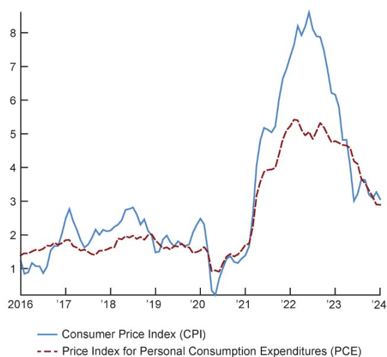
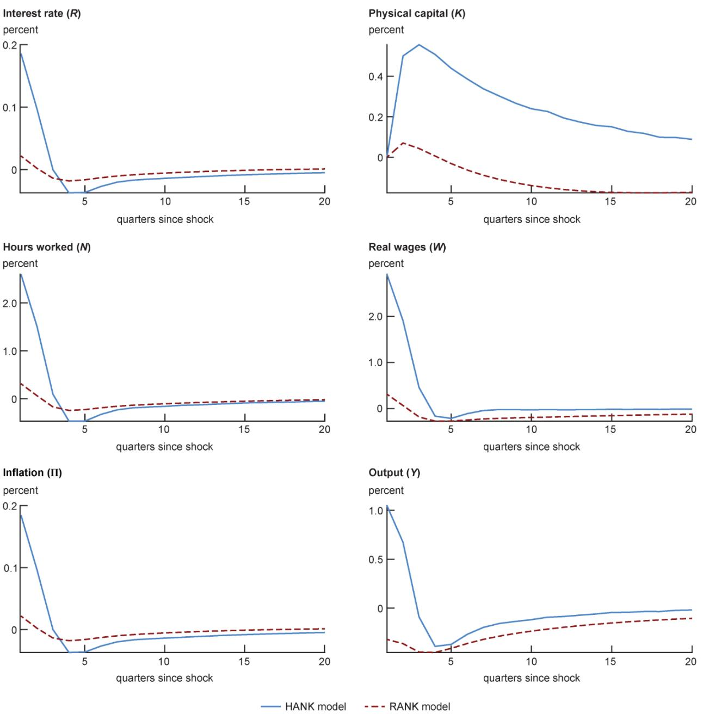
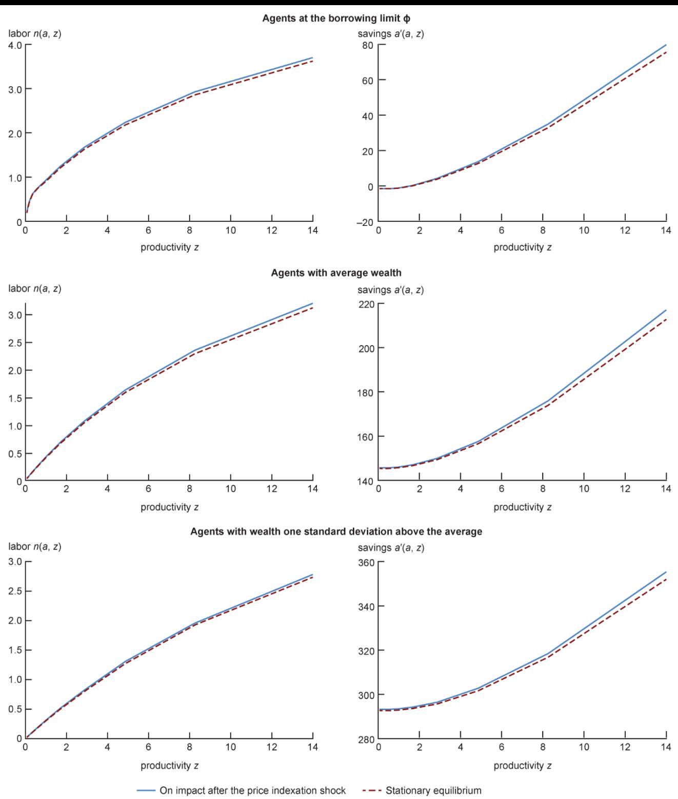
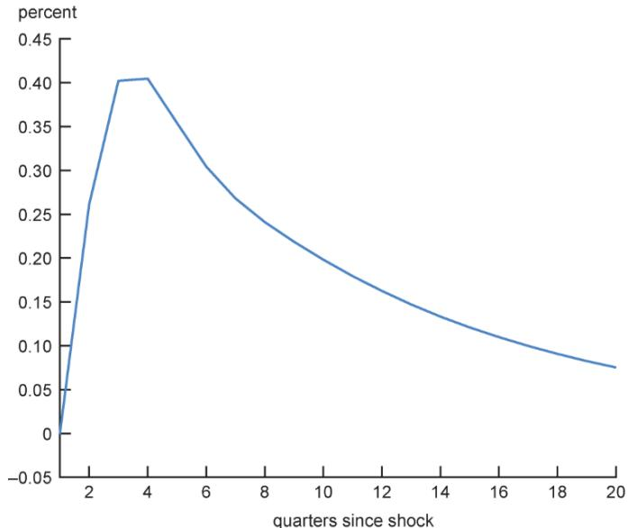
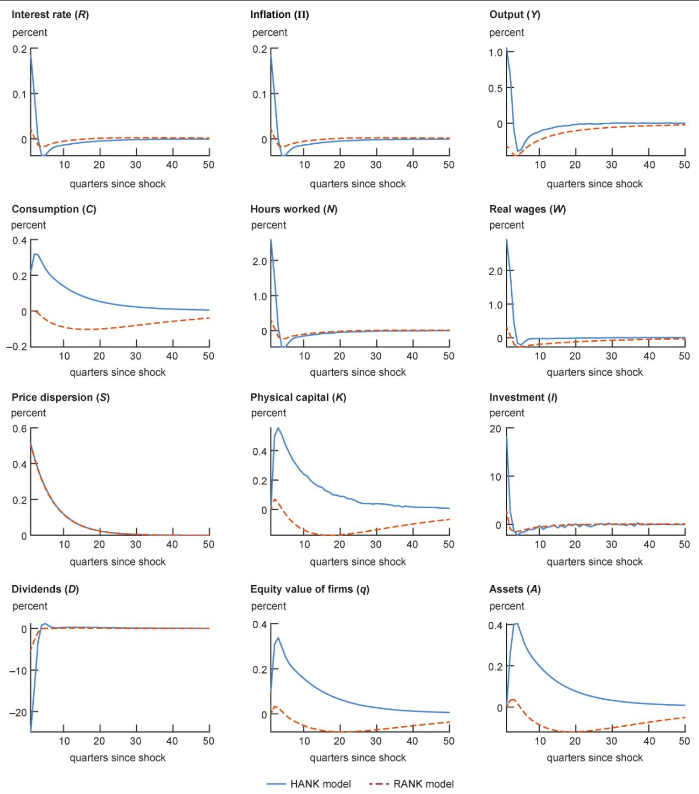

# Inequality and shocks to firms' pricing decisions

Filippo Ferroni, senior economist, and Alessandro T. Villa, economist

# Introduction and summary

After two decades of extremely stable inflation, prices have grown markedly in the past few years, as shown in figure 1. Part of this increase in prices can be traced to factors affecting firms' pricing decisions, which presumably depend on where firms think inflation is heading. See, for example, figure 2, which shows the interquartile range of responses from the Survey of Firms' Inflation Expectations (SoFIE)—the Cleveland Fed's survey of CEOs about their outlooks on inflation. The specific question that SoFIE asks is as follows: "What annual inflation rate do you think the U.S. Federal Reserve is trying to achieve on average?" These inflation expectations supposedly inform firms' price setting of their goods (and services). Figure 2 shows that before the Covid- 19 pandemic, the median response to this question was  $2\%$  and the distribution was skewed to the right. As illustrated by figure 1, inflation surged in 2021- 22. Simultaneously, as illustrated by figure 2, the median of the medium- term inflation expectations rose by 50- 100 basis points from pre- pandemic levels and the distribution of the SoFIE responses skewed further to the right (that is, toward the upside). From this perspective, it would seem that inflation expectations became temporarily

  
1. CPI and PCE inflation, 2016-24

Notes: The CPI inflation data are from the U.S. Bureau of Labor Statistics, and the PCE inflation data are from the U.S. Bureau of Economic Analysis. Year- over- year percent changes in inflation are plotted.

Sources: U.S. Bureau of Labor Statistics and U.S. Bureau of Economic Analysis from Haver Analytics.

2. Federal Reserve Bank of Cleveland's Survey of Firms'Inflation Expectations,2018-24  

<table><tr><td>Year</td><td>Lower bound</td><td>Median</td><td>Upper bound</td></tr><tr><td>2018</td><td>2.0</td><td>2.0</td><td>2.5</td></tr><tr><td>2019</td><td>1.9</td><td>2.0</td><td>2.5</td></tr><tr><td>2020</td><td>1.5</td><td>1.6</td><td>2.0</td></tr><tr><td>2021</td><td>2.0</td><td>2.5</td><td>3.0</td></tr><tr><td>2022</td><td>2.0</td><td>3.0</td><td>4.0</td></tr><tr><td>2023</td><td>2.0</td><td>3.0</td><td>3.5</td></tr><tr><td>2024</td><td>2.0</td><td>2.0</td><td>2.8</td></tr></table>

Notes: Responses to the SoFIE question of what annual inflation rate the Fed is trying to achieve on average are collected in April of each year. This figure reports the responses (rates in percentage points) that fall within the two middle quartiles of the distribution: The lower and upper bounds are those of the interquartile range (that is, the middle  $50\%$  of the distribution). See note 1 for further details.

Source: Federal Reserve Bank of Cleveland, Survey of Firms' Inflation Expectations (SoFIE).

unanchored from the Federal Reserve's  $2\%$  inflation target. To what extent can these changes impact inflation and output? On the one hand, higher price setting tends to increase the equity value of the firms, which benefits shareholders. On the other hand, higher price setting tends to increase the nominal wage, which benefits workers. Hence, the rise in inflation and inflation expectations can have uneven consequences for different households, which, in turn, can affect the level of inequality in the economy. Does this differential impact matter for inflation and output?

We use a staggered- price New Keynesian model with heterogeneous agents to answer these questions. In the model, some firms will not be able to set their prices optimally at each point in time (because of menu costs or information frictions). When firms cannot reset the price of their good optimally, they index their previously set price in part based on the past observed inflation rate and in part based on their view of where inflation is heading. Hence, we shock their perceptions about future inflation while leaving unchanged the Federal Reserve's inflation target of  $2\%$  in our model. This is a scenario where firms' expectations become unanchored, at least temporarily, but the Fed continues to follow its policy rule—which prescribes responding to inflation more than one for one whenever inflation is above or below the  $2\%$  target—and the firms know this. This article is organized as follows. In the next section, we present our staggered- price New Keynesian model with heterogeneous agents, describing its environment at a general level. Following that section, we discuss the calibration of the model and then go over the results of a simulation where an unexpected shock temporarily raises the inflation target  $(\pi^{\bar{x}})$  in the firms' price indexation rule. Next, we discuss the main economic mechanism that propagates the effects of the price indexation shock in our model economy. To close, we summarize the results from our model with heterogeneous agents relative to those from a counterpart model with a representative agent.

# Model

We build on a broad class of medium- scale dynamic general equilibrium models, typically used in central banks. These models seek to describe the entire economy as the interactions between various sectors and markets (for example, households, firms, and government) in a state of equilibrium where supply equals demand subject to nominal price rigidities (or price stickiness). In particular, we consider a heterogeneous agents New Keynesian (HANK) model with uninsurable idiosyncratic risk to household productivity, borrowing constraints, and nominal rigidities à la Calvo (1983) with staggered price setting. In this section, we describe the environment at a general level (see the appendix for details about the equilibrium conditions).

# The environment

The economy is populated by a unit continuum of ex ante identical households with standard preferences over consumption and leisure. Households are endowed with stochastic idiosyncratic productivity that affects their labor income. Each household's productivity  $(z_{t})$  is exogenous and follows  $\log z_{t} = \rho_{z}\log z_{t - 1} + \xi_{z,t},$  with  $\xi_{z,t}\sim N(0,\sigma_z^2)$ , where  $\rho_{z}$  is the persistence of the process and where  $\xi_{z,t}$  is a random variable that follows a normal distribution (indicated by  $N$ ) with variance  $\sigma_z^2$ . Households decide how much to work, consume, and save. The household assets comprise government bonds, physical capital, and firms' equity. There is a borrowing constraint that prevents these households from taking asset positions lower than a certain negative level  $(\phi_{a})$ . While their optimal decisions are ex ante identical, the differences in household productivity induce different labor income and asset accumulations and, therefore, different consumption and saving decisions. These differences among households, in turn, generate wealth and income inequality. Hence, the model collapses to the representative agent New Keynesian (RANK) model if the uninsurable idiosyncratic shocks  $(z)$  are removed.

The market structure of this model economy combines elements that are familiar from the standard New Keynesian literature (Smets and Wouters, 2007) with elements that are familiar from the standard incomplete

markets model literature (McKay, Nakamura, and Steinsson, 2016). While the final good is produced by a representative competitive firm, the intermediate goods are produced by monopolistically competitive firms. These firms are controlled by a risk- neutral manager who discounts future profits at rate  $\beta$ , as in McKay, Nakamura, and Steinsson (2016). Profits are paid out to the households, with each household receiving a share of  $D_{t}$  proportional to its asset holdings. Unlike in McKay, Nakamura, and Steinsson (2016), households can trade firms' equity as well as the capital stock used in production. Finally, households trade a risk- free real bond with real interest rate  $R_{t}$  between periods  $t$  and  $t + 1$ . There is a stock of government debt outstanding with the real face value  $B_{t}$ . The government raises tax revenue to finance interest payments on this debt. These taxes are collected by levying a flat tax on households' income from labor and dividends.

The intermediate goods firms face frictions in adjusting their prices that imply that they can only update their prices with probability  $\theta$  per period, as in Calvo (1983). When they are not allowed to update, they adjust their price according to an indexation rule that combines the past value of inflation  $(\pi_{t - 1})$  with the central bank's inflation target  $(\pi^{*})$ , as in Smets and Wouters (2007); in particular, after  $s$  periods without the chance of reoptimizing the price, a firm sets its price  $(p_{s}^{*})$  according to the following rule:

$$
p_{s}^{*} = X_{s}p^{*},
$$

where  $p^{*}$  is the price when the firm had the last chance to choose it optimally and  $X_{s}$  is the indexation rule, with

$$
X_{s} = \Pi_{l = 1}^{s}\big(1 + \pi_{l - 1}\big)^{l - p}\big(1 + \pi^{*}\big)^{1 - \iota_{p}}.
$$

For example, in the period immediately after the last optimal price choice, that is,  $s = 1$ , the new price is adjusted as  $\left(1 + \pi\right)^{s}\left(1 + \pi^{*}\right)^{1 - p}$ . The parameter  $\iota_{p}$  measures the degree at which prices are adjusted based on the past levels of inflation. When  $\iota_{p} = 0$ , for example, the price will be adjusted using only the central bank's inflation target. (In the indexation rule,  $\Pi$  indicates the product operator with iterator  $l$ .) Indexation captures the fact that firms set prices only partially to reflect their view on future inflation. We assume that in the short run, firms increase indexed prices faster, thereby reflecting their view that higher inflation is expected, which is what we observe in the Cleveland Fed survey results (figure 2). Simultaneously, we assume that the same firms stick to their belief that the Fed follows a Taylor rule with an inflation target of  $2\%$ . Thus, indexing to a moving inflation target generates higher inflation. We interpret this scenario as a mild form of unanchoring.

In the model, these firms produce intermediate goods, which are sold to the final good producer. The final good producer's cost minimization problem yields

$$
y = \left(\frac{p^{*}}{P}\right)^{\frac{\mu}{1 - \mu}}Y,
$$

where the demand for the firm- specific good  $(y)$  depends on its price  $(p^{*})$ , the overall price  $(P)$ , aggregate output  $(Y)$ , and the relative price demand elasticity  $\left(\epsilon = - \frac{\mu}{1 - \mu}\right)$ . The lower the demand elasticity, the larger the desired markup  $(\mu > 1)$  that the firm can charge to buyers. Hence, when intermediate goods producers can update their price, they set it by taking into account a production constraint and the demand constraint of the final good producer.

Because firms know that they might not be able to optimize the price of their good in the future, their decision entails choosing a price optimal also for a number of future periods where they most likely will not be allowed to reoptimize; thus, their problem is inherently dynamic. The solution to the firms' problem is a markup rule where a firm charges a fixed markup  $\mu$  over a weighted- average of future discounted marginal costs  $\gamma_{s}$  (as captured by equation A17 in the appendix). The weight for each future marginal cost has two elements to it: the term  $\beta (1 - \theta)$ , which puts less weight on future marginal costs because of discounting ( $\beta$  is the discount factor) and because the price being set now has lower probabilities of still being around in  $s$  periods of time as  $s$  gets bigger ( $\theta$  is price stickiness), and the term  $\left(\frac{P X_{s}}{P_{s}}\right)^{\frac{\mu}{1 - \mu}} Y_{s}$ , which represents aggregate factors affecting firm demand in the future. In this article, we are interested in what happens when the firms' indexation rule,  $X_{s}$ , unexpectedly increases (via an increase in the inflation target,  $\pi^{*}$ , in the firms' price- setting function).

Finally, the central bank controls the nominal risk- free interest rate by following a simplified Taylor rule, whereby the interest rate  $(i_{t})$  reacts more than one for one with inflation. In particular, the rule is given by

$$
i_{t} = R + \pi^{*} + \phi_{\pi}(\pi_{t} - \pi^{*}),
$$

where  $R$  represents the long- run real interest rate and  $\phi_{\pi} > 1$  (that is, the response of the central bank to the inflation gap).

# Calibration

Our model period is one quarter, and our calibration is summarized in figure 3. We calibrate the persistence and the standard deviation of the idiosyncratic productivity shocks so that  $\rho_{z} = 0.939$  and  $\sigma_{z} = 0.287$ , respectively. We fix the steady- state real interest rate at  $2\%$  annually and adjust the discount factor to match this. We assume that household preferences are separable in consumption  $(c)$  and labor  $(n)$ , that is,  $u(c_{t}) - \nu (n_{t}) = \frac{c_{t}^{1 - \sigma_{c}}}{1 - \sigma_{c}} - \frac{n_{t}^{1 + \sigma_{n}}}{1 + \sigma_{n}}$ , where  $u$  is the utility of consumption,  $\nu$  is the disutility of labor,  $1 / \sigma_{c}$  is the elasticity of intertemporal substitution (or equivalently, the inverse of the coefficient of relative risk), and  $1 / \sigma_{n}$  is the Frisch elasticity of labor supply. We set the coefficient of relative risk aversion to 1 and the Frisch elasticity of labor supply to 1. Both values are within the range of values typically considered in the literature. For our choices of the desired markup of intermediate firms,  $\mu$ , and probability of maintaining a fixed price,  $\theta$ , we follow Christiano, Eichenbaum, and Rebelo (2011) and set  $\mu = 1.2$  and  $\theta = 0.15$ . The degree of indexation to past inflation is 0.2, close to the estimated mode value obtained by Smets and Wouters (2007). Capital share and depreciation are set to standard values in the literature, that is, 0.4 and 0.02, respectively. We assume that households can borrow up to a limit  $\phi_{a}$ , which we fix at  $- 1.5$ . This parameter is calibrated so that the borrowing limit corresponds to one quarter of average labor income.

3. Calibration of the model parameters  

<table><tr><td>Parameter</td><td>Description</td><td>Value</td><td>Target or source</td></tr><tr><td>Discount factor</td><td>β</td><td>0.99</td><td>2% annual real interest rate</td></tr><tr><td>Risk aversion</td><td>σc</td><td>1</td><td>Standard value</td></tr><tr><td>Frisch elasticity</td><td>1/σn</td><td>1</td><td>Standard value</td></tr><tr><td>Price markup</td><td>μ</td><td>1.2</td><td>Christiano, Eichenbaum, and Rebelo (2011)</td></tr><tr><td>Price stickiness</td><td>θ</td><td>0.15</td><td>Christiano, Eichenbaum, and Rebelo (2011)</td></tr><tr><td>Indexation on past inflation</td><td>νp</td><td>0.2</td><td>Smets and Wouters (2007)</td></tr><tr><td>Capital share</td><td>α</td><td>0.4</td><td>60% labor share of income</td></tr><tr><td>Capital depreciation</td><td>δ</td><td>0.02</td><td>Standard value</td></tr><tr><td>Inflation target</td><td>π*</td><td>0.005</td><td>2% annual inflation</td></tr><tr><td>Monetary policy response to inflation</td><td>φπ</td><td>1.5</td><td>Taylor (1993)</td></tr><tr><td>Persistence of the idiosyncratic productivity shock</td><td>ρz</td><td>0.939</td><td>Chang, Kim, and Schorfheide (2013)</td></tr><tr><td>Standard deviation of the idiosyncratic productivity shock</td><td>σz</td><td>0.286</td><td>Chang, Kim, and Schorfheide (2013)</td></tr></table>

# Results

We assume that at time zero, the economy is at its stationary equilibrium and an unexpected shock temporarily raises the inflation target  $(\pi^{*})$  in the firms' price indexation rule. In particular, we calibrate the shock so that, on impact, the inflation target drifts positively by 50 basis points annually and then reverts back to zero with relatively high persistence (0.9). For the sake of comparison, we feed identical shocks to both the HANK model and its RANK counterpart. Typically, firms and the central bank have the same inflation target in their policy functions. However, we assume that firms perceive a temporary inflation target increase, while the central bank sticks to a  $2\%$  target. Hence, the unexpected one- time change in the price indexation rule only affects firms' pricing decisions and it does not change the central bank's inflation target in the monetary policy rule. We view this as a tractable way to capture information frictions that can arise in the short term. Explicitly modeling these frictions is outside the scope of this article. Figures 4, 5, and 6 report the dynamic transmission of these shocks to the economy.

We first discuss the dynamic propagation of the price indexation shock to macroeconomic aggregates, which are reported in figure 4.

# Mechanism and comparison of the HANK and RANK models

In this subsection, we compare the impulse responses of some macroeconomic variables in the HANK and RANK models, given that the inflation target  $(\pi^{*})$  in the firms' price indexation rule unexpectedly increases by 50 basis points, as described before. As a result of the price increase from the price indexation shock,

  
4. Impulse responses of select macroeconomic variables to the price indexation shock in the HANK model versus the RANK model  Notes: This figure shows the impulse responses of six macroeconomic variables to the same price indexation shock (described in the text) in the heterogeneous agents New Keynesian (HANK) model (solid line) and in the representative agent New Keynesian (RANK) model (dashed line). The impulse responses are the percentage point deviations of the variables from stationary equilibrium. Source: Authors' calculations.

there is an increase in marginal costs, which include real wages. This happens for both the HANK and the RANK models, as illustrated in figure 4.

While in both models there is a strong income effect pushing the labor supply down, the substitution effect dominates and agents are willing to work more to increase their savings because there are larger returns from investing in capital and in shares of the firms. This effect is stronger in the HANK model because dividends are unevenly distributed and agents have an incentive to acquire shares of the firms. To show this, we analyze labor and savings decisions at the individual level in the HANK model. In particular,

# 5. Policy functions on impact after the price indexation shock and at the stationary equilibrium in the HANK model

  
Notes: This figure shows slices of the policy functions (representing the optimal choices for labor and savings) for three different levels of agents' assets  $a$  (that is, their wealth) and across all productivity levels  $z$  in the heterogeneous agents New Keynesian (HANK) model. For all six panels, the variables (labor, savings, and productivity) are normalized to indexes.

Source: Authors' calculations.

  
Notes: This figure shows the impulse response of aggregate assets to the price indexation shock (described in the text) in the heterogeneous agents New Keynesian (HANK) model. The impulse response is the percentage point deviation of aggregate assets from stationary equilibrium.

Source: Authors' calculations.

figure 5 shows the optimal choices for labor and savings for different productivity and wealth levels. The continuous blue line in each of the panels corresponds to the optimal choices on impact after the price indexation shock, whereas the dashed red line corresponds to the same decision rules in the absence of the shock (that is, in the stationary equilibrium). We find that highly productive agents, especially those with low to moderate levels of wealth (shown in the first two pairs of panels of figure 5), tend to work and save more relative to those with lower productivity. In aggregate, as shown in figure 6, the average amount of assets increases during the transition to the stationary equilibrium. This amplification mechanism is quantitatively significant as long as agents can invest in firms' shares. Endogenous equity ownership incentivizes agents to invest in physical capital as they can take advantage of future higher dividends, which are not redistributed uniformly across agents in the HANK model, but according to their stock ownership. This is also confirmed by the second- to- last panel in the bottom set of panels of figure A1 in the appendix, which reports the percentage change of the equity value  $q$  of the firms. The equity value  $q$  clearly increases persistently well above the stationary equilibrium in the HANK model, while it does not do this in the RANK model. Finally, in an alternative exercise (not shown), where we assume that the shares of the firms are evenly distributed, this mechanism is significantly dampened, rendering this response in the HANK model closer to that in the RANK model.8

Another amplification mechanism in the HANK model comes from the presence of uninsurable idiosyncratic risk, leading agents to engage in precautionary savings to shield against future negative productivity shocks.9

For these reasons, as illustrated by figure 4, aggregate labor  $(N)$  increases by more in the HANK model than in the RANK model. In the HANK model, agents exploit their initial boost in labor income to repay debt and/or invest in physical capital. The top right panel of figure 4 shows that in the HANK model, physical capital  $(K)$  in aggregate increases persistently and remains well above the counterpart in the RANK model.10

In order to clear the asset market, characterized by higher savings and investment levels, the interest rate  $(R)$  goes up by more in the HANK model, as illustrated by the top left panel of figure 4. This increase in the interest rate is consistent with higher inflation levels via the Taylor rule. Furthermore, the high levels of savings and investment that push the interest rate up are chiefly due to the assumption of endogenous ownership of firms' shares. In its absence, the responses of both inflation and the interest rate are closer to their responses in the RANK model.

Finally, because of this strong saving and investment motive, the amplification mechanism in the HANK model transforms the supply nature of the shock observed in the RANK model into a demand- type transmission.

# Conclusion

In this article, we study the propagation mechanisms of a shock that affects the firms' pricing decisions; in particular, we look at the dynamics transmission of an increase in the inflation target in the firms' price indexation rule. We studied the dynamics transmission of such a shock in a New Keynesian model with heterogeneous agents, incomplete markets, and nominal rigidities, and we compared it with the dynamics transmission from the same shock in a counterpart model with a representative agent. First, we find that this shock has sizable real effects in both cases. Second, we show that in the HANK model, agents exploit the initial higher wage by working more and saving more in order to engage in precautionary savings. This mechanism boosts physical capital accumulation and equity market values, thereby creating a substantial amplification of the shock's effects. Third, this mechanism transforms the supply nature of the shock observed in the RANK model into a demand- type transmission.

To summarize, we study how a shock to the firms' price indexation rule influences aggregate outcomes through the inequality among agents in an economy, represented by a New Keynesian model with heterogeneous agents. We compare the aggregate dynamics in this model with those in a representative agent model. We find that such shocks have significant real effects in both models, but in the HANK model, agents respond by increasing labor and savings, leading to higher capital accumulation and equity values.

# Notes

Notes1 We thank Edward S. Kostek II, senior vice president and director of research in the Research Department at the Federal Reserve Bank of Cleveland, for sharing information about the percentile of the distribution of SoFiE responses.2 When the distribution of data is right- skewed, this means the data are not distributed symmetrically around the mean and the long tail of the distribution is to the right of the mean.3 Menu costs are the costs that firms incur when they change the prices of their goods (or services). Information frictions come from economic agents infrequently updating their sets of information.4 Price rigidity is the resistance of a market price to change fast, even when shifting economic conditions suggest a different price would be optimal.5 In equilibrium, since there is no aggregate risk, firms' equity and bonds are perfect substitutes.6 The elasticity of demand  $(\in)$  and seller's desired markup  $(\mu)$  are determined by the Lerner condition, which implies that  $\mu = \frac{\epsilon}{\epsilon - 1}$ .7 Chang, Kim, and Schoffriede (2013) estimated these persistence and volatility values using the entire sample of the Panel Study of Income Dynamics (PSID)—with all participants in the study being 18–65 years old. We discretize this process using the Rouwenhorst method, as in Kopecky and Suen (2010), with an 11- valued Markov chain.8 Although we do not show the results of this alternative exercise in this article, those results are available on request.9 There is no aggregate risk in both the HANK and RANK models.10 Note that the government bond supply is held constant to the stationary equilibrium value during the transition to the stationary equilibrium; hence, all savings are invested in physical capital and equity value.

# Appendix: The model in greater detail

Appendix: The model in greater detailIn this appendix we describe the model in greater detail. The model is a standard HANK model with price rigidities à la Calvo (1983), staggered price setting, and capital accumulation. The full dynamics of the model are reported in figure A1.

A1. Impulse responses of macroeconomic variables to the price indexation shock in the HANK model versus the RANK model

  
Notes: This figure shows the impulse responses of 12 macroeconomic variables to the same price indexation shock (described in the main text) in the heterogeneous agents New Keynesian (HANK) model (solid line) and in the representative agent New Keynesian (RANK) model (dashed line). The impulse responses are the percentage point deviations of the variables from stationary equilibrium. Source: Authors' calculations.

# Environment

Time is discrete and infinite,  $t = 0,1,2,\ldots$  The economy is made up of a continuum of households  $i\in [0,1]$  ; a final firm; a continuum of intermediate firms  $j\in [0,1]$  ; a monetary authority; and a government.

# Households

Households Households receive utility from consumption and disutility from labor, which is divisible and indexed 0 to 1. Each period, a household makes labor supply, consumption, and saving decisions. At the beginning of each period, each household receives an idiosyncratic labor productivity shock  $z$ , determined according to a discrete Markov process with transition probability matrix  $P_z(z'|z)$ . Households borrow up to a borrowing constraint  $\phi_a$ . To simplify notation, we avoid explicitly denoting each household with  $i$ . Hence, the household consumption saving decisions are captured by the solution of the following program:

$$
V\left(b_{t},s_{t},k_{t},z_{t}\right) = \max_{b_{t + 1},s_{t + 1},k_{t + 1},n_{t},c_{t}}u\left(c_{t}\right) - \nu \left(n_{t}\right) + \beta \mathbb{E}\left[V\left(b_{t + 1},s_{t + 1},k_{t + 1},z_{t + 1}\right)\left|b_{t},z_{t}\right.\right]
$$

subject to

$$
c_{t} + b_{t + 1} + s_{t + 1} + k_{t + 1} = (1 - \tau)\cdot z_{t}W_{t}n_{t} + R_{t}^{b}\cdot b_{t} + T_{t} + \frac{q_{t} + (1 - \tau)\cdot D_{t}}{q_{t - 1}} s_{t} + (1 - \delta)k_{t} + r_{t}^{k}k_{t},
$$

A3)  $b_{t + 1} + s_{t + 1} + k_{t + 1} > \phi_a,$

where  $c$  is consumption,  $n$  is labor supply,  $a$  is assets,  $r$  and  $w$  are real interest rates and wages,  $z$  is idiosyncratic productivity shocks,  $s_t = \tilde{S}_tq_{t - 1}$  , and  $\tau$  is a labor tax. Aggregate transfers (and therefore each household's transfer)  $T_{t}$  are set as a fraction of total output. Labor supply is such that households equate the marginal utilities of consumption and labor.

Hence, the intratemporal labor- consumption margin is

$$
u^{\prime}(c_{t})\cdot s_{t}W_{t}\cdot (1 - \tau) = \nu^{\prime}(n_{t}).
$$

The first- order condition with respect to  $a_{t + 1},s_{t + 1}$  , and  $k_{t + 1}$  is

$$
1 - \mu_{t} = \mathbb{E}_{t}\left[\beta \frac{u^{\prime}(c_{t + 1})}{u^{\prime}(c_{t})}\cdot R_{t + 1}^{b}\right],
$$

$$
1 - \mu_{t} = \mathbb{E}_{t}\left[\beta \frac{u^{\prime}(c_{t + 1})}{u^{\prime}(c_{t})}\cdot \frac{q_{t + 1} + (1 - \tau)\cdot D_{t + 1}}{q_{t}}\right],
$$

$$
1 - \mu_{t} = \mathbb{E}_{t}\left[\beta \frac{u^{\prime}(c_{t + 1})}{u^{\prime}(c_{t})}\cdot \left(R_{t + 1}^{k} - \delta\right)\right],
$$

where  $\mu_t$  is the Lagrange multiplier associated with the borrowing constraint. We solve an equivalent problem with  $a_{t} = b_{t} + s_{t} + k_{t}$ ; hence,

$$
V\left(a_{t},z_{t}\right) = \max_{a_{t + 1},n_{t},c_{t}}u\left(c_{t}\right) - \nu \left(n_{t}\right) + \beta \mathbb{E}\left[V\left(a_{t + 1}\right)\mid a_{t},z_{t}\right]
$$

subject to

$$
c_{t} + a_{t + 1} = (1 - \tau)\cdot z_{t}W_{t}n_{t} + R_{t}\cdot a_{t} + T_{t},
$$

A10)  $a_{t + 1}\geq \phi_{a},$

with

$$
\begin{array}{l}{R_{t + 1} = R_{t + 1}^{b},}\\ {R_{t + 1} = \frac{q_{t + 1} + (1 - \tau)\cdot D_{t + 1}}{q_{t}},}\\ {R_{t + 1} = R_{t + 1}^{k} - \delta .} \end{array}
$$

Note that in the stationary equilibrium, the second equation becomes  $q^{*} = \frac{(1 - \tau)\cdot D^{*}}{R^{*} - 1}$ .

# Final firm

The output of the final good producer is  $Y$ , which combines a continuum of intermediate goods  $y_{j}$  according to

$$
Y_{t} = \left(\int_{0}^{1}y_{j,t}^{\mu}dj\right)^{\frac{1}{\mu}},
$$

where  $1 / \mu$  is the elasticity parameter across the continuum of intermediate goods. The static profit maximization problem of the final firm yields the demand for intermediate goods:

$$
y_{j,t} = \left(\frac{p_{j,t}}{P_t}\right)^{\frac{1}{1 - \mu}}Y_t,
$$

where  $P_{t} = \left(\int_{0}^{1}p_{j,t}^{\frac{1}{1 - \mu}}dj\right)^{1 - \mu}$ .

# Intermediate goods producers problem with indexation

The intermediate goods producers solve the following problem:

$$
\max_{p_t^*,\{n_{j,s},k_{j,s},y_{j,s}\}_{s = s = t}}\sum_{s = t}^{\infty}\beta^{s - t}\left(1 - \theta\right)^{s - t}\left(\frac{p_t^*X_{t,s}}{P_s} y_{j,s} - W_{s}n_{j,s} - r_s^k k_{j,s}\right)
$$

subject to

$$
\begin{array}{rl} & y_{j,s} = \left(\frac{p_t^*X_{t,s}}{P_s}\right)^{\frac{\mu}{1 - \mu}}Y_s,\\ & y_{j,s} = Zk_{j,s}^\alpha n_{j,s}^{1 - \alpha},\\ & X_{t,t} = 1,\\ & X_{t,s} = \Pi_{l = 1}^{s - t}\left(1 + \pi_{t + l - 1}\right)^{t_p}\left(1 + \pi_{t + l}^*\right)^{1 - 1_p},s = t + 1,t + 2,\ldots . \end{array}
$$

First, minimize the cost statically. Hence, solve

$$
\min_{\{n_{j,s},k_{j,s},y_{j,s}\}_{s = t}^{\infty}}W_{s}n_{j,s} + r_{s}^{k}k_{j,s}
$$

subject to

$$
Zk_{j,s}^{\alpha}n_{j,s}^{1 - \alpha} = y_{j,s}.
$$

The two first- order conditions (FOCs) are

$$
\begin{array}{rl} & {\gamma_{j,s}\alpha Zk_{j,s}^{\alpha -1}n_{j,s}^{1 - \alpha} = r_s^k,}\\ & {\gamma_{j,s}Zk_{j,s}^{\alpha}\left(1 - \alpha\right)n_{j,s}^{-\alpha} = W_s,} \end{array}
$$

where  $\gamma$  is the Lagrange multiplier on the constraint. Hence, we rewrite the FOCs as

$$
\begin{array}{rl} & {\gamma_{j,s}\alpha y_{j,s} = r_s^k k_{j,s},}\\ & {\gamma_{j,s}y_{j,s}\left(1 - \alpha\right) = W_sn_{j,s}.} \end{array}
$$

By summation, we get

$$
\gamma_{j,s}y_{j,s} = r_s^k k_{j,s} + W_sn_{j,s}.
$$

Notice that the capital- labor ratio is the same across firms because it depends on only aggregate quantities and parameters (we take the ration between the two FOCs):

$$
\frac{k_{j,s}}{n_{j,s}} = \frac{\alpha}{1 - \alpha}\frac{W_s}{r_s^k}.
$$

The production function can then be written as

$$
y_{j,s} = \left(\frac{\alpha}{1 - \alpha}\frac{W_s}{r_s^k}\right)^\alpha n_{j,s}.
$$

We substitute the first two equations to get

$$
\max_{p_t^*,\{y_{j,s}\}_{s = t}^\infty}\sum_{s = t}^\infty \beta^{s - t}\left(1 - \theta\right)^{s - t}\left(\frac{p_t^*X_{t,s}}{P_s} -\gamma_{j,s}\right)y_{j,s}
$$

subject to

$$
\begin{array}{rl} & X_{t,t} = 1,\\ & X_{t,s} = \Pi_{l = 1}^{s - t}\left(1 + \pi_{t + l - 1}\right)^{t_p}\left(1 + \pi_{t + l}^*\right)^{1 - t_p},s = t + 1,t + 2,\ldots . \end{array}
$$

The first- order condition with respect to  $p_t^*$  is

$$
\sum_{s = t}^{\infty}\beta^{s - t}\left(1 - \theta\right)^{s - t}\frac{X_{t,s}}{P_s}\left[\left(\frac{p_t^*X_{t,s}}{P_s}\right)^{\frac{\mu}{1 - \mu}} + \left(\frac{p_t^*X_{t,s}}{P_s} -\gamma_s\right)\frac{\mu}{1 - \mu}\left(\frac{p_t^*X_{t,s}}{P_s}\right)^{\frac{\mu}{1 - \mu} -1}\right]Y_s = 0,
$$

which after dividing by  $\left(p_t^*\right)^{\frac{\mu}{1 - \mu}}$  further simplifies to

$$
\sum_{s = t}^{\infty}\beta^{s - t}\left(1 - \theta\right)^{s - t}\frac{X_{t,s}}{P_s}\left(\frac{X_{t,s}}{P_s}\right)^{\frac{\mu}{1 - \mu}}\left[1 + \frac{\mu}{1 - \mu} -\gamma_s\frac{\mu}{1 - \mu}\left(\frac{p_t^*X_{t,s}}{P_s}\right)^{-1}\right]Y_s = 0,
$$

which becomes

$$
\sum_{s = t}^{\infty}\beta^{s - t}\left(1 - \theta\right)^{s - t}\frac{X_{t,s}}{P_s}\gamma_s\frac{\mu}{1 - \mu}\left(\frac{X_{t,s}}{P_s}\right)^{-1}\left(\frac{X_{t,s}}{P_s}\right)^{\frac{\mu}{1 - \mu}}Y_s = \sum_{s = t}^{\infty}\beta^{s - t}\left(1 - \theta\right)^{s - t}\left(\frac{X_{t,s}}{P_s}\right)^{\frac{\mu}{1 - \mu}}\frac{X_{t,s}}{P_s}\left[\frac{1}{1 - \mu}\right]Y_s.
$$

Hence, we have that

$$
\sum_{s = t}^{\infty}\beta^{s - t}\left(1 - \theta\right)^{s - t}\gamma_s\mu \left(\frac{X_{t,s}}{P_s}\right)^{\frac{\mu}{1 - \mu}}Y_s = p_t^*\sum_{s = t}^{\infty}\beta^{s - t}\left(1 - \theta\right)^{s - t}\frac{X_{t,s}}{P_s}\left(\frac{X_{t,s}}{P_s}\right)^{\frac{\mu}{1 - \mu}}Y_s,
$$

or equivalently,

$$
p_t^* = \mu \frac{\sum_{s = t}^{\infty}\beta^{s - t}\left(1 - \theta\right)^{s - t}\left(\frac{X_{t,s}}{P_s}\right)^{\frac{\mu}{1 - \mu}}Y_s\gamma_s}{\sum_{s = t}^{\infty}\beta^{s - t}\left(1 - \theta\right)^{s - t}\left(\frac{X_{t,s}}{P_s}\right)^{\frac{1}{1 - \mu}}Y_s}.
$$

After dividing everything by  $P_t$  and multiplying by  $\left(\frac{P_t}{P_t}\right)^{\frac{\mu}{1 - \mu}} = 1$  the right- hand side, the latter expression becomes

$$
\frac{p_t^*}{P_t} = \mu \frac{\sum_{s = t}^{\infty}\beta^{s - t}\left(1 - \theta\right)^{s - t}\left(\frac{P_tX_{t,s}}{P_s}\right)^{\frac{\mu}{1 - \mu}}Y_s\gamma_s}{\sum_{s = t}^{\infty}\beta^{s - t}\left(1 - \theta\right)^{s - t}\left(\frac{P_tX_{t,s}}{P_s}\right)^{\frac{1}{1 - \mu}}Y_s},
$$

which is the New Keynesian Phillips curve (NKPC) under Calvo with price indexation.

# Recursive New Keynesian Phillips curve with indexation

Define

$$
P_{t}^{A}\equiv \sum_{s = t}^{\infty}\beta^{s - t}\left(1 - \theta\right)^{s - t}\left(\frac{P_{t}X_{t,s}}{P_{s}}\right)^{\frac{\mu}{1 - \mu}}Y_{s}\mu \gamma_{s},
$$

and

$$
P_{t}^{B}\equiv \sum_{s = t}^{\infty}\beta^{s - t}\left(1 - \theta\right)^{s - t}\left(\frac{P_{t}X_{t,s}}{P_{s}}\right)^{\frac{1}{1 - \mu}}Y_{s}.
$$

Following McKay, Nakamura, and Steinsson (2016), we have

$$
\frac{p_t^*}{P_t} = \frac{P_t^A}{P_t^B}.
$$

This equation can be expressed recursively as follows:

$$
\begin{array}{l} P_t^A = Y_t\mu \gamma_t + \beta (1 - \theta)\left(\frac{P_tX_{t,t + 1}}{P_{t + 1}}\right)^{\frac{\mu}{1 - \mu}}P_{t + 1}^A,\\ \displaystyle P_t^B = Y_t + \beta (1 - \theta)\left(\frac{P_tX_{t,t + 1}}{P_{t + 1}}\right)^{\frac{1}{1 - \mu}}P_{t + 1}^B, \end{array}
$$

where

$$
X_{t,t + 1} = \left(1 + \pi_t\right)^{\iota_p}\left(1 + \pi_{t + 1}^*\right)^{1 - \iota_p}.
$$

# Aggregate price with indexation

The aggregate price level is given by

$$
P_{t} = \left(\int p_{j,t}^{\frac{1}{1 - \mu}}dj\right)^{1 - \mu} = \left[\theta p_{j,t}^{\frac{1}{1 - \mu}} + (1 - \theta)\int p_{j,t}^{\frac{1}{1 - \mu}}dj\right]^{1 - \mu}.
$$

By substituting  $p_{j,t} = p_{j,t - 1}\left(1 + \pi_{t - 1}\right)^{\iota_p}\left(1 + \pi_t^*\right)^{1 - \iota_p} = p_{j,t - 1}X_{t - 1,t}$ , we obtain

$$
P_{t}^{\frac{1}{1 - \mu}} = \theta p_{t}^{\frac{1}{1 - \mu}} + (1 - \theta)X_{t - 1,t}^{\frac{1}{1 - \mu}}\int p_{t - 1}^{\frac{1}{1 - \mu}}dj,
$$

which can be further simplified to

$$
P_{t}^{\frac{1}{1 - \mu}} = \theta p_{t}^{\frac{1}{1 - \mu}} + (1 - \theta)X_{t - 1,t}^{\frac{1}{1 - \mu}}P_{t - 1}^{\frac{1}{1 - \mu}}.
$$

We divide everything by  $P_{t - 1}^{\frac{1}{1 - \mu}}$  to get

$$
1 + \pi_{t} = \left[\theta \left(\frac{p_{t}^{*}}{P_{t - 1}}\right)^{\frac{1}{1 - \mu}} + (1 - \theta)X_{t - 1,t}^{\frac{1}{1 - \mu}}\right]^{1 - \mu},
$$

or equivalently,

$$
1 + \pi_{t} = \left[0\left((1 + \pi_{t})\frac{p_{t}^{*}}{P_{t}}\right)^{\frac{1}{1 - \mu}} + (1 - \theta)X_{t - 1,t}^{\frac{1}{1 - \mu}}\right]^{1 - \mu}.
$$

This yields an expression for inflation:

$$
1 + \pi_{t} = \left(\frac{(1 - \theta)X_{t - 1,t}^{\frac{1}{1 - \mu}}}{1 - \theta\left(\frac{p_{t}^{*}}{P_{t}}\right)^{\frac{1}{1 - \mu}}}\right)^{1 - \mu}.
$$

# Dispersion of prices law of motion with indexation

We now derive the aggregate dispersion of prices, after pushing it one period forward:

$$
\begin{array}{rl}{S_{t + 1}} & {= \int (\frac{p_{j,t + 1}}{P_{t + 1}})^{\frac{\mu}{1 - \mu}}d\boldsymbol {j}}\\ & {= \theta (\frac{p_{t + 1}^{*}}{P_{t + 1}})^{\frac{\mu}{1 - \mu}} + (1 - \theta)\int \frac{X_{t,t + 1}}{P_{t + 1}}\frac{p_{j,t}}{P_{t}})^{\frac{\mu}{1 - \mu}}d\boldsymbol {j}}\\ & {= \theta (\frac{p_{t + 1}^{*}}{P_{t + 1}})^{\frac{\mu}{1 - \mu}} + (1 - \theta)X_{t,t + 1}^{\frac{\mu}{1 - \mu}}(1 + \pi_{t + 1})^{-\frac{\mu}{1 - \mu}}\int (\frac{p_{j,t}}{P_{t}})^{\frac{\mu}{1 - \mu}}d\boldsymbol {j}}\\ & {= \theta (\frac{p_{t + 1}^{*}}{P_{t + 1}})^{\frac{\mu}{1 - \mu}} + (1 - \theta)X_{t,t + 1}^{\frac{\mu}{1 - \mu_{t + 1}}}(\boldsymbol {1} + \pi_{t + 1})^{-\frac{\mu}{1 - \mu}}S_{t}.} \end{array}
$$

Hence,  $S_{t}$  evolves according to

$$
S_{t + 1} = \theta \left(\frac{p_{t + 1}^{*}}{P_{t + 1}}\right)^{\frac{\mu}{1 - \mu}} + (1 - \theta)X_{t,t + 1}^{\frac{\mu}{1 - \mu}}(1 + \pi_{t + 1})^{-\frac{\mu}{1 - \mu}}S_{t}.
$$

Note also that

$$
\int y_{j,t}d j = \int \left(\frac{p_{j,t}}{P_{t}}\right)^{\frac{\mu}{1 - \mu}}Y_{t}d j,
$$

where  $\int y_{j,t}d j = Z\int k_{j,t}^{\alpha}n_{j,t}^{1 - \alpha}d j$  ; hence,

$$
\begin{array}{c}{\int Zk_{j,t}^{\alpha}n_{j,t}^{1 - \alpha}d j = \int \left(\frac{p_{j,t}}{P_{t}}\right)^{\frac{\mu}{1 - \mu}}d j Y_{t} = S_{t}Y_{t},}\\ {y_{j,s} = \gamma_{j,s}^{-1}r_{s}^{k}k_{j,s} + \gamma_{j,s}^{-1}W_{s}n_{j,s}.} \end{array}
$$

Finally, note that  $\gamma_{j} = \gamma_{s}$  which implies that

$$
\int y_{j,s}d j = \gamma_{s}^{-1}r_{s}^{k}\int k_{j,s}d j + \gamma_{s}^{-1}W_{s}\int n_{j,s}d j = \gamma_{s}^{-1}r_{s}^{k}K_{s} + \gamma_{s}^{-1}W_{s}N_{s}.
$$

# Government budget

The government budget constraint is  $B_{t + 1} + \tau D_t + \tau \int ztW_tn_td\Lambda = R_tB_t + G_t + T_t,$

where  $\Lambda$  is the cumulative distribution function (CDF) of agents, with associated probability density function (PDF)  $\lambda$

# Market clear

In equilibrium the labor market clears

$$
\int z_t n_t d\Lambda = N_t.
$$

The bond market clears

$$
\int a_t d\Lambda = B_t + \int s_t d\Lambda + K_t = B_t + q_{t - 1} + K_t,
$$

where

$$
\int s_t d\Lambda = \int \tilde{s}_t q_{t - 1} d\Lambda = q_{t - 1} \int \tilde{s}_t d\Lambda = q_{t - 1} \tilde{S} = q_{t - 1}.
$$

The aggregate dividend is given by

$$
D_{t} = Y_{t} - W_{t}N_{t} - r_{t}^{k}K_{t} = \left(1 - \gamma_{t}S_{t}\right)Y_{t},
$$

and the resource constraint is as follows:

$$
C_t + I_t + G_t = Y_t.
$$

# Stationary equilibrium

In the stationary equilibrium, all aggregate quantities are fixed and inflation is equal to the exogenous target  $\pi^{*}$ . We have that

$$
\begin{array}{l}{P^A = Y\mu \gamma +\beta (1 - \theta)P^A,}\\ {}\\ {P^B = Y + \beta (1 - \theta)P^B.} \end{array}
$$

This implies that

$$
\frac{p^{*}}{P} = \frac{p^{A}}{p^{B}} = \mu \gamma ,
$$

which is the usual rule for markup over marginal cost. In the steady state, we have

$$
1 + \pi^{*} = \left(\frac{(1 - \theta)\left(1 + \pi^{*}\right)^{\frac{1}{1 - \mu}}}{1 - \theta\left(\frac{p^{*}}{P}\right)^{\frac{1}{1 - \mu}}}\right)^{1 - \mu},
$$

which becomes

$$
1 - \theta \left(\frac{p^{*}}{P}\right)^{\frac{1}{1 - \mu}} = \frac{(1 - \theta)\left(1 + \pi^{*}\right)^{\frac{1}{1 - \mu}}}{(1 + \pi^{*})^{\frac{1}{1 - \mu}}} = 1 - \theta ,
$$

yielding this expression

$$
\frac{p^{*}}{P} = 1.
$$

Therefore, we have that

$$
\gamma = \mu^{-1}.
$$

Also, in the steady state,

$$
S = \left(\frac{p^{*}}{P}\right)^{\frac{\mu}{1 - \mu}} = 1.
$$

Given the guess for  $R$  and  $N$ , we find capital, wage, and  $Y$  such that

$$
\begin{array}{l}\gamma \alpha SY = r^k K,\\ \gamma (1 - \alpha)SY = WN. \end{array}
$$

Combining these equations, we get that

$$
K = \frac{\alpha}{1 - \alpha}\frac{N}{R - 1 + \delta} W.
$$

Combining this equation with  $SY = \gamma^{- 1}r^{k}K + \gamma^{- 1}WN$ , we obtain the labor share:

$$
SY = \gamma^{-1}(1 - \alpha)^{-1}WN.
$$

Finally, integrating the production function, we obtain

$$
SY = \left(\frac{\alpha}{1 - \alpha}\frac{W}{R - 1 + \delta}\right)^{\alpha}N,
$$

which leads to

$$
W = \big(\gamma \big)^{\frac{1}{1 - \alpha}}\alpha^{\frac{\alpha}{1 - \alpha}}\big(1 - \alpha \big)\big(R - 1 + \delta \big)^{-\frac{\alpha}{1 - \alpha}}.
$$

# Solution method

The model is solved with global methods. For the stationary equilibrium, we guess the interest and aggregate labor and then solve for the household policy functions, calculate the corresponding transition matrix and population ergodic distribution, and then compute the implied aggregate quantities. We search for the implied aggregate quantities that match the guesses using the Levenberg- Marquardt algorithm. For the unexpected shocks, we fix a long enough time horizon and guess paths for interest rates and the firms' total costs. Given the guesses, we compute the corresponding policy functions period by period in the backward phase and adjust the guesses in the forward phase by clearing all markets. We repeat this until adjustments to both guessed paths are numerically small.

# References

Calvo, Guillermo A., 1983, "Staggered prices in a utility- maximizing framework," Journal of Monetary Economics, Vol. 12, No. 3, September, pp. 383- 398. Crossref

Chang, Yongsung, Sun- Bin Kim, and Frank Schorfheide, 2013, "Labor- market heterogeneity, aggregation, and policy (in)variance of DSGE model parameters," Journal of the European Economic Association, Vol. 11, Supplement 1, January, pp. 193- 220. Crossref

Christiano, Lawrence, Martin Eichenbaum, and Sergio Rebelo, 2011, "When is the government spending multiplier large?," Journal of Political Economy, Vol. 119, No. 1, February, pp. 78- 121. Crossref

Kopecky, Karen A., and Richard M. H. Suen, 2010, "Finite state Markov- chain approximations to highly persistent processes," Review of Economic Dynamics, Vol. 13, No. 3, July, pp. 701- 714. Crossref

McKay, Alisdair, Emi Nakamura, and Jon Steinsson, 2016, "The power of forward guidance revisited," American Economic Review, Vol. 106, No. 10, October, pp. 3133- 3158. Crossref

Smets, Frank, and Rafael Wouters, 2007, "Shocks and frictions in US business cycles: A Bayesian DSGE approach," American Economic Review, Vol. 97, No. 3, June, pp. 586- 606. Crossref

Taylor, John B., 1993, "Discretion versus policy rules in practice," Carnegie- Rochester Conference Series on Public Policy, Vol. 39, December, pp. 195- 214. Crossref

Economic Perspectives is published by the Economic Research Department of the Federal Reserve Bank of Chicago. The views expressed are the authors' and do not necessarily reflect the views of the Federal Reserve Bank of Chicago or the Federal Reserve System.

Marcelo Veracierto, Economics Editor; Helen Koshy and Han Y. Choi, Editors; Julia Baker, Senior Production Editor; Sheila A. Mangler, Editorial Assistant.

$\mathbb{C}$  2024 Federal Reserve Bank of Chicago

Economic Perspectives articles may be reproduced in whole or in part, provided the articles are not reproduced or distributed for commercial gain and provided the source is appropriately credited. Prior written permission must be obtained for any other reproduction, distribution, republication, or creation of derivative works of Economic Perspectives articles. To request permission, please contact Helen Koshy, managing editor, at 312- 505- 6723 or email Helen.Koshy@chi.frb.org. Economic Perspectives and other Bank publications are available at https://www.chicagofed.org.

ISSN 0895- 0164