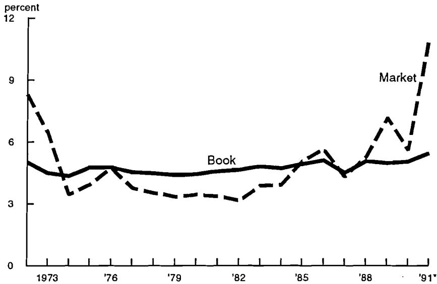
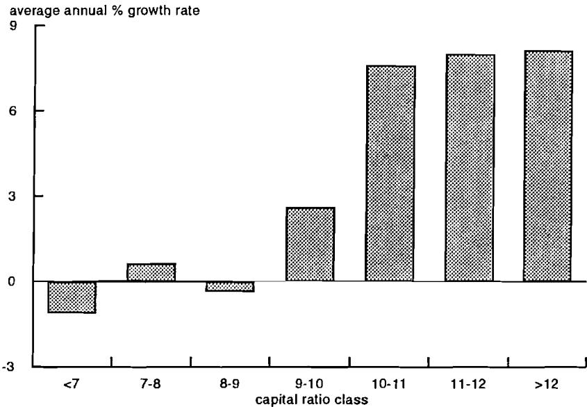
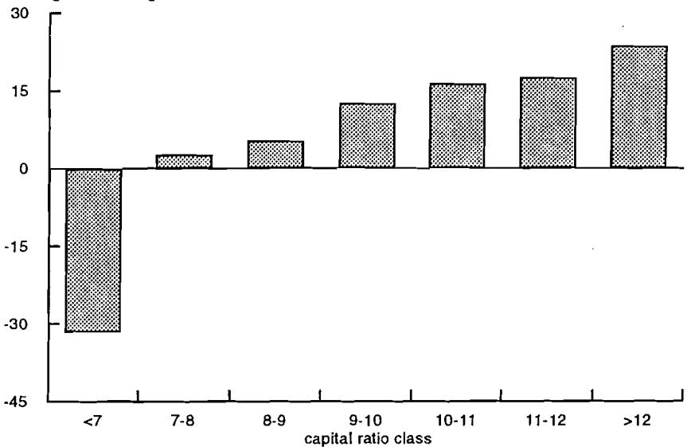

# Capital Adequacy and the Growth of U.S. BanksHerbert Baer and John McElravey

Working Papers SeriesIssues in Financial RegulationResearch DepartmentFederal Reserve Bank of ChicagoJune 1992 (WP- 92- 11)

# Capital Adequacy and the Growth of U.S. Banks

Herbert Baer and John McElravey*

# I. Introduction

The frequency and mounting cost of bank and thrift failures and their role in depleting the deposit insurance funds has caused bank regulators in the United States to increasingly emphasize capital requirements. The most recent step taken to improve bank capital adequacy was in 1990 when U.S. regulators began phasing in risk- based capital guidelines based on international standards negotiated under the auspices of the Bank for International Settlements (BIS). By year- end 1992, commercial banks in the major industrial countries will face capital requirements at least as strict as the BIS requirements. While the implementation of risk- based capital standards has been the subject of considerable discussion, another change in capital requirements for U.S. commercial banks has received much less attention. In 1990, U.S. regulators replaced the primary capital ratio, previously the principal measure of capital adequacy, with the "Tier 1 Leverage Ratio"- - the ratio of tier 1 equity to total assets. This leverage limit was established as a supplement to the risk- based guidelines to "place a constraint on the maximum degree to which a banking organization can leverage its equity capital base."1

The purpose of this paper is to document how various measures of regulatory and economic capital are related to the growth of U.S. bank holding companies between June 1989 and October 1991. Changes in bank growth rates can reflect changes in bank risk, the size of penalties for not complying with regulatory capital requirements, and strategic behavior as capital- deficient banks redeploy assets to return to regulatory compliance. Two measures of regulatory capital are examined in detail: the risk- based capital ratio and the tier 1 equity- to- asset ratio. However, an analysis of major bank and thrift failures during the 1980s suggests that regulatory measures of capital can be at odds with economic measures of capital that are relevant to creditors. We examine one economic measure of capital: the banks' market

equity ratios have risen to nearly 5.5 percent. This improvement in equity ratios may be partly a result of the capital requirements imposed on banks and bank holding companies.4 (See Chart 1. )

# Chart 1

Common equity to asset ratio for large BHCs

*As of 1991: 3Q.  Source: Compustat

While regulatory capital ratios edged upward during the 1980s, economic measures of bank capital increased dramatically. The market capitalization ratios of U.S. banking organizations increased from a low of 3.2 percent in 1982 to more than 5.6 percent by 1986, perhaps reflecting the improved quality of bank accounting for loan losses. Market capitalization continued to climb after 1986, reaching 11.1 percent by the third quarter of 1991. This further increase may reflect investors' opinions about the industry's future profitability as deregulation and consolidation proceed.

Banking organizations experiencing growth, either internally or through acquisition, will be expected to maintain capital levels well above those dictated by their existing portfolio risks and operational capabilities. While bank regulators do not disclose the minimum tier 1 leverage ratio that they require for a bank, it appears that for most banks the minimum is at least five percent.13

The tier 1 leverage ratio is not only tougher than the old primary capital requirements, it also imposes more serious constraints on bank asset growth than do the risk- based capital requirements. Returning to our example bank, it would comply with the risk- based capital standards with \(36 million of tier 1 capital. Recall, however, that this bank had\)1 billion in balance sheet assets (\(100 million in T - bonds,\)400 million in mortgages, and $500 million in C&I loans). Its leverage ratio, therefore, would be 3.5 percent. Assuming a required leverage ratio of 5 percent, this bank would either have to raise \(14 million of tier 1 capital or it would have to shrink its balance sheet assets. Shifting among different types of assets would offer no relief because no weights are applied to the assets for calculation of the leverage ratio. The leverage limit, though, does not incorporate off - balance - sheet activities. As a result, our bank has the option of shifting some of its balance sheet activities off the balance sheet, and thus maintaining the overall size of its activities. In general, banks operating at or near their minimum leverage ratio, but with capital in excess of the risk - based limits, would be expected to shrink total on - balance - sheet assets, and increase off - balance - sheet activities.

# D. The Cost of Raising Capital

When confronted with the choice of remaining in compliance with the leverage limit by raising additional equity or shrinking assets, banks will often choose to shrink assets. It is often (though not always) extremely costly for corporations in general, and banks in particular, to raise additional outside equity. One study, by Asquith and Mullins (1986), found that the average nonfinancial corporation's existing shareholders lost 28 cents for every additional dollar of equity raised through the issuance of new shares. This decline in share prices occurs because purchasers of new shares demand compensation for the possibility that existing management and shareholders are misrepresenting the firm's true financial condition.

designed to measure a banking organization's capital adequacy assuming that it finds issuing new shares to be extremely expensive.

Using the do- nothing risk- based capital ratio and the do- nothing equity- to- asset ratio as measures of capital adequacy, many of the BHCs in our sample were going to need to take steps to raise their capital ratios above their 1989 levels. Using a do- nothing equity- to- asset ratio of 5 percent as the measure of capital adequacy, 23 BHCs with 37.9 percent of the assets in the sample were capital deficient. Using a do- nothing risk- based capital ratio of 8 percent as the measure of capital adequacy, nine BHCs representing 15.7 percent of the assets in the sample were capital deficient. Six of the nine BHCs with low risk- based capital also had equity ratios below our 5 percent cutoff. The remaining 96 BHCs in our sample exceeded both of these cutoffs.

In order to measure the importance of the leverage limit on BHC growth, each organization was assigned to one of seven capital adequacy categories depending on its do- nothing equity- to- asset ratio. The definitions of the categories and the distribution of the banking organizations are given in Table 1. To measure the importance of the risk- based capital requirements on asset growth, each BHC was also assigned to one of seven capital adequacy categories depending on its do- nothing risk- based capital ratio. These categories are also given in Table 1. Do- nothing risk- based capital was calculated from regulatory reports filed with the Federal Reserve. However, risk- weighted credit exposure for June 1989 had to be estimated because the regulatory reports at that time did not contain all the information needed to calculate it directly. Our method of estimating credit exposures, which is detailed in the appendix, yields results which closely match published estimates for the time period.

To assess the impact of a BHC's capital adequacy on its growth, we employ regression analysis. Each regression included six dummy variables for the capital position of a BHC. A dummy variable took on the value one if a BHC's capital ratio fell within that category, and was set to zero otherwise. Definitions of these dummy variables correspond to the capital classes in Table 1.

# A. The Risk-Based Capital Requirement

The relationship between a BHC's risk- based capital and its on balance sheet asset growth is summarized in Chart 2. Detailed regression results are reported in the upper half of Table 2. The growth rates of BHCs with risk- based capital ratios below the 8 percent regulatory minimum are significantly different from those BHCs above 8 percent. The nine BHCs with inadequate risk- based capital ratios- - below 8 percent- - registered no growth in total assets.

# Chart 2

# Impact of risk-based capital ratios on asset growth 6/8/9 to 9/91*

*Don't nothing risk- based capital ratio: (beginning period total capital (tier 1 + tier 2) + earnings retained during period)/(beginning of period risk- weighted credit exposure).

Among banks that exceed the 8 percent minimum, there is a dichotomy between BHCs with levels of capital that are well in excess of the minimum requirements, and those with capital only modestly in excess of the regulatory minimums. The 82 banking organizations with risk- based capital ratios of more than 10 percent grew at an average annual rate of approximately 8 percent. Another 37 banking organizations, with risk- based capital ratios between 8 percent and 10 percent, had sufficient capital to meet the risk- based standard, exhibited slower asset growth than their better- capitalized competitors. BHCs in the 8 to 9 percent risk- based capital class showed no growth in assets (like capital- deficient BHCs), and BHCs in the 9 to 10 percent class grew only 2.6 percent. BHCs with risk- based capital ratios between 8 and 10 percent were free to grow as rapidly as their better- capitalized competitors, but chose not to do so. This result suggests that BHCs wish to maintain a buffer of capital in excess of regulatory minimums because they perceive a significant cost to becoming capital deficient.

While the risk- based capital requirements do affect the behavior of U.S. banking organizations, differences in risk- based capital ratios explain only 12 percent of the variability in asset growth of the BHCs in this sample. This suggests that risk- based capital is not particularly important in determining the differences in growth rates among U.S. banking organizations. Other factors are clearly at work.

The relative unimportance of risk- based capital requirements is not entirely surprising. Only nine holding companies had do- nothing risk- based capital ratios below the 8 percent minimum, and only a third of our BHCs had do- nothing risk- based capital ratios below the critical 10 percent level. The inability of risk- based capital requirements to explain much of the variation in asset growth may also be due to the ability of BHCs to comply with the risk- based rules by redeploying assets into lower risk- weight classes and eliminating off- balance- sheet exposures.

ratios between 5 percent and 7 percent. Although regulators have some flexibility in determining the minimum equity- to- asset ratio for individual banking organizations, BHCs in this category would appear to have adequate capital to grow and still remain in compliance. Despite having capital above the regulatory minimum, these institutions chose not to grow as rapidly as their better- capitalized competitors. BHCs with do- nothing equity ratios between 5 and 6 percent shrank at an annualized 5 percent rate, just as rapidly as many of the BHCs with equity ratios below the minimum. BHCs with equity ratios between 6 and 7 percent grew at an annual rate of 4.4 percent- - significantly slower than their better- capitalized competitors, but faster than those BHCs with do- nothing equity ratios below the regulatory limit.

While we assume in this study that the regulatory minimum enforced by the Federal Reserve is a 5 percent equity- to- asset ratio, these results indicate that BHC growth is constrained when the equity- to- asset ratio falls below the 6 percent level, and possibly even below the 7 percent level. There are four possible explanations for this behavior. First, being capital deficient is so costly that BHCs voluntarily shrink in order to increase their equity buffer. Second, the regulatory minimum equity- to- asset ratios is actually 6 percent or higher. Third, BHCs are so unclear about the true minimum that they are building a buffer just in case it turns out that the minimum equity ratio is above 5 percent. Finally, regulatory measures of capital can be at odds with economic measures, so that if capital adequacy decisions are being dictated by the market, increased levels of book equity would be required.

The impact of differences in do- nothing equity ratios on asset growth is similar to that found using the risk- based measure, but more dramatic. The BHCs in our sample are much more likely to run afoul of the leverage limit than the risk- based capital requirement. Differences in equity ratios explain 45 percent of the variation in growth rates, while differences in risk- based capital ratios are able to explain only 12 percent of the variation in growth rates (See Chart 4). We also find that including information on a BHC's risk- based capital position was not useful in predicting which ones would grow and which would not. Finally, the shrinkage of BHCs with low equity ratios is greater than the shrinkage of BHCs with low risk- based capital ratios. For instance, BHCs with equity to asset ratios below 3 percent shrank, on average, at a 3.3 percent annual rate while BHCs with risk- based capital ratios below 7 percent shrank by only 1 percent. These findings are consistent with our view that the risk- based capital requirement imposes fewer restrictions on BHC behavior than does the leverage limit.

# Table 3

# Impact of Capital Adequacy on Risk-Weighted Off-Balance-Sheet Activity Growth Regression Results

Risk- Based Capital Ratio Dependent Variable: Risk- Weighted Off- Balance- Sheet Items

<table><tr><td></td><td>β</td><td>σ</td></tr><tr><td>Intercept</td><td>23.64***</td><td>3.79</td></tr><tr><td>RDJM6</td><td>-55.02***</td><td>12.57</td></tr><tr><td>RDJM7</td><td>-21.01**</td><td>9.28</td></tr><tr><td>RDJM8</td><td>-18.30***</td><td>6.72</td></tr><tr><td>RDJM9</td><td>-11.18*</td><td>5.83</td></tr><tr><td>RDJM10</td><td>-7.32</td><td>5.36</td></tr><tr><td>RDJM11</td><td>-6.11</td><td>5.83</td></tr></table>

N = .127  R- square = .1784

Book Equity Ratio Dependent Variable: Risk- Weighted Off- Balance- Sheet Items

<table><tr><td></td><td>β</td><td>σ</td></tr><tr><td>Intercept</td><td>22.22***</td><td>3.05</td></tr><tr><td>DUM2</td><td>-39.96***</td><td>10.23</td></tr><tr><td>DUM3</td><td>-25.69***</td><td>7.99</td></tr><tr><td>DUM4</td><td>-24.50***</td><td>6.41</td></tr><tr><td>DUM5</td><td>-16.88***</td><td>5.90</td></tr><tr><td>DUM6</td><td>-10.53*</td><td>5.76</td></tr><tr><td>DUM7</td><td>2.77</td><td>4.61</td></tr><tr><td>N = .127</td><td></td><td></td></tr><tr><td>R-square = .2724</td><td></td><td></td></tr></table>

\*\*\* \*\* significant at the .01, .05, .10 levels, respectively.

# Chart 6

# Impact of risk-based-capital ratios on risk-weighted off-balance-sheet credit growth*

average annual % growth rate

*Don nothing risk- based capital ratio: (beginning period total capital (tier 1 + tier 2) + earnings retained during period)/(beginning of period risk- weighted credit exposure).

Second, the most highly- capitalized BHCs increased their off- balance- sheet activities more rapidly than their on- balance sheet activities, while the most poorly- capitalized BHCs shrank them more rapidly. (See Charts 5 and 6. ) For example, BHCs with risk- based capital ratios above 12 percent increased their risk- weighted off- balance- sheet activities at a 23.6 percent annual rate, while BHCs with risk- based capital below 7 percent decreased them by 31.4 percent. These findings suggest that BHCs find it less costly to manage their off- balance- sheet exposures than their on- balance- sheet exposures.

of capital, not by the ability to generate equity internally through retaining earnings.

We find that differences in the internal rate of capital generation of BHCs have a significant impact on the rate of asset growth, but only for BHCs with equity- to- asset ratios above 7 percent. (See Table 4. ) In order to account for differences in internal capital generation rates within each capital class, we calculate the difference between each bank's internal capital generation rate and the mean rate for its capital class. As noted above, internal capital generation rates should be related to asset growth if a BHC is unconstrained by its level of capital. The statistical significance of the internal capital generation rate variable for BHCs with equity ratios above 7 percent indicates that these organizations are behaving as if they are constrained by the high cost of issuing new shares, not by concerns about regulatory pressures. Conversely, differences in the internal rate of capital generation had little or no impact on differences in asset growth at BHCs with do- nothing equity ratios below 7 percent. This evidence provides further support for our contention that asset growth at BHCs with capital levels below 7 percent is being driven primarily by regulatory penalties associated with the level of capital.

# IV. Conclusions

It appears that a large portion of the variability in the growth of U.S. bank holding companies is being driven by regulatory policy, and that regulators are focussing on the newly imposed leverage restriction. Indeed, 42 percent of the banking organizations in our sample behaved as if they were constrained by the leverage limit. These BHCs accounted for about 67 percent of the total assets of BHCs in our sample. Despite the significant attention given to risk- based capital requirements over the last five years, we find that they have had a relatively minor impact on BHC growth.

We also find that the level of capital at which either of the capital requirements becomes binding is well above the published regulatory minimums. For all practical purposes, U.S. BHCs, or U.S. regulators, are behaving as if the minimum equity- to- asset ratio is 7 percent, and the minimum risk- based capital ratio is 10 percent. One possible explanation for this behavior is that BHCs find it costly to fall below the published minimums. To avoid incurring these costs, they choose to hold extra capital as a cushion. An alternative explanation is that regulators begin exerting pressure on BHCs well before their capital ratios fall to the published minimums.

While some may find this strong regulatory role inappropriate, we believe that regulatory policies which buffer BHCs from market- based restraints on growth make aggressive regulatory action the only option for protecting the integrity of the banking system and its deposit insurance funds. The key question is whether regulatory action is being exercised in a capricious manner. In general, we believe it is not. During the period of our study, most of the BHCs with do- nothing capital ratios below the 5 percent level were poorly valued by the market and their shares were highly volatile. In the absence of government deposit guarantees, these BHCs would have faced substantial depositor pressure to reduce their assets and liabilities or raise additional capital.

In order to test our methodology, risk- based capital ratios as of year- end 1989 reported in an American Banker survey (Thursday, April 19, 1990) of the 100 largest bank holding companies were compared to year- end 1989 ratios calculated using our method. Eighty- three of the banks on the survey list were also in our data set. Some banks in the survey reported their ratios using the final 1992 rules, while others used the Federal Reserve's transitional rules. Our method applied the 1992 final rules. A t- test on the difference between the means of the two ratios indicated that they were not statistically different from each other, and the correlation coefficient on the two ratios (0.6463) was statistically different from zero at the one percent level. An additional test of our methodology was to regress asset growth on risk- based capital classes using the American Banker data, and to compare it to a regression using our calculated risk- based ratio. For this sample of bank holding companies, the regression results were comparable. (See Table A- 1. ) Based on these tests, our method for estimating risk- weighted credit exposure and risk- based capital ratios for 1989 seem, on average, to be reliable.

# Footnotes

1- Capital Adequacy Guidelines for Bank Holding Companies and State Member Banks", Registration Y (12 CFR 225), Tier 1 Leverage Measure, Federal Reserve Regulatory Service, p. 4- 798.

2 During the 1950s and 1960s, the Federal Reserve System calculated a type of risk- based capital standard called the "Form for Analyzing Bank Capital," or ABC Form. However, it does not appear that any attempt was made to enforce capital requirements based on the ABC Form. Paul M. Horvitz, Director of Research at the FDIC, noted in 1968 that "individual bank scores on the capital adequacy formula (ABC Form) show a very wide dispersion which indicates that probably neither the banks nor the Federal Reserve take it very seriously, ... See Horvitz (1968).

3 See Federal Reserve Bulletin, January 1982, p. 33 for the announcement of these capital adequacy guidelines.

4 For example, see Wall and Peterson (1987); and Keeley (1988).

5 Whether the increased number of failures in the banking system occurred because of decisions made prior to the introduction of the primary capital requirements, was a consequence of a conscious decision to increase risk following the introduction of primary capital requirements, or was completely independent phenomena is open to debate. There is some evidence that the rising failure rate was a reflection of losses incurred prior to the introduction of the primary capital requirements but not recognized until long afterwards. Market- to- book ratios for the industry were well below 1 from the mid- 1970s onward, indicating the presence of unbooked losses. Meanwhile, the industry's exposure to oil price shocks and LDC debt, both major contributors to the failures in the mid- 1980s, had already been laid on by the time the primary capital requirements became effective. However, Furlong (1988) presents evidence that there was an increase in bank asset risk following the introduction of primary capital requirements.

6 See Pavel and McElravey (1990) for a summary of globalization in the financial services industry.

7 See Cooper, Kolari, and Wagster (1991) for important dates in the chronology of the international agreement on risk- based capital standards.

8 See Cordell and King (1991).

9 Off- balance sheet items include foreign exchange contracts, interest rate swaps, and stand- by letters of credit.

10- Tier 1 (core) capital is defined as common stockholders' equity, qualifying perpetual preferred stock (subject to certain restrictions), and minority interest in the equity accounts of consolidated subsidiaries. Items qualifying as tier 2 (supplementary) capital are loan- loss reserves (up to 1.25 percent of risk- weighted credit exposure), perpetual preferred stock (subject to limitations), hybrid capital instruments, perpetual debt, mandatory convertible debt securities, term subordinated debt, and intermediate- term preferred stock.

11 In fact, it appears that many of the larger bank holding companies were guilty of underproviding for loan losses because their market- to- book ratios were below 1 for much of the 1980s.

12 See Capital Adequacy Guidelines, p. 4- 798.

13 At least some organizations are unclear about the standard to which they will be held. In its 1991 annual report, Citicorp states "Citicorp has not been advised by the Federal Reserve Board or the FFIEC as to a specific required leverage ratio applicable to it." Former FDIC Chairman

# References

Asquith, Paul, and David W. Mullins, "Equity Issues and Offering Dilution," Journal of Financial Economics, 15, January/February 1986, p. 61- 89.

Board of Governors of the Federal Reserve System, Capital Adequacy Guidelines, Regulation Y (12 CFR 225), March 1989.

Board of Governors of the Federal Reserve System, "Announcements", Federal Reserve Bulletin, January 1982, p. 33.

Cooper, Kerry, James Kolari, and John Wagster, "A Note on the Stock Market Effects of the Adoption of Risk- Based Capital Requirements on International Banks in Different Countries," Journal of Banking and Finance, 15, 1991, pp. 367- 381.

Cordell, Lawrence R., and Kathleen Kuester King, "A Market Evaluation of the Importance of Considering Non- Credit Risk in Setting Risk- Based Capital Standards," Board of Governors of the Federal Reserve System, Mimeo, December 1991.

Feldstein, Martin, "Revise Bank Capital Standards Now," Wall Street Journal, March 6, 1992, p. A10.

Fazzari, Steven M., R. Glenn Hubbard, and Bruce C. Petersen, "Financing Constraints and Corporate Investment," Brookings Papers on Economic Activity, 1988, pp. 141- 195.

Furlong, Frederick T., "Changes in Bank Risk- Taking," Economic Review, Federal Reserve Bank of San Francisco, Spring 1988, pp. 45- 56.

Horwitz, Paul M., "Discussion," in Proceedings of a Conference on Bank Structure and Competition, Federal Reserve Bank of Chicago, 1968, p. 113.

Keeley, Michael C., "Bank Capital Regulation in the 1980s: Effective or Ineffective?," Economic Review, Federal Reserve Bank of San Francisco, Winter 1988, pp. 3- 20.

Pavel, Christine, and John N. McElravey, "Globalization in the Financial Services Industry," Economic Perspectives, Federal Reserve Bank of Chicago, May/June 1990, pp. 3- 18.

Peek, Joe, and Eric Rosengren, "The Capital Crunch: Neither a Borrower nor a Lender Be," Mimeo, November 1991.

# Working Paper Series

Working Paper SeriesA series of research studies on regional economic issues relating to the Seventh Federal Reserve District, and on financial and economic topics.

# REGIONAL ECONOMIC ISSUES

Construction of Input- Output Coefficients with Flexible Functional Forms 20000000000000000000000000000000000000000000000000000000000000000000000000000000000000000000000000000. .000000000000000000000000000000000000000000000000000000000000000000000000000000000000000000000000000

Regional Regulatory Effects on Bank Efficiency 20000000000000000000000000000000000000000000000000000000000000000000000000000000000000000000000000. . . . . . . . . . . . . . . . . . . . . . . . . . . . . . . . . . . . . . . . . . . . . . . . . . . . . . . . . . . . . . . . . . . . . . . . . . . . . . . . . . . . . . . . . . . . . . . . . . . . . ..

Regional Growth and Development Theory: Summary and Evaluation 20000000000000000000000000000000000000000000000000000000000000000000000000000000000000000000000000Geoffrey J.D. Hewings

Institutional Rigidities as Barriers to Regional Growth: A Midwest Perspective 20000000000000000000000000000000000000000000000000000000000000000000000000000000000000000000000000

Calibrating Manufacturing Decline in the Midwest: Valued Added, Gross State Product, and all Points Between William A. Testa and David D. Weiss

The Midwest Economy: Quantifying Growth and Diversification in the 1990's 2000000000000000000000000000000000000000000000000000000000000000000000000000000000000000000000000010000000000000000000000000000000000000000000000000000000000000000000000000000000000000000000000000001010000000000000000000000000000000000000000000000000000000000000000000000000000000000000000000000000

Issues in State Taxation of Banks 20000000000000000000000000000000000000000000000000000000000000000000000000000000000000000000000000Richard H. Mattoon

Job Flight and the Airline Industry: The Economic Impact of Airports on Chicago and Other Metro Areas 20000000000000000000000000000000000000000000000000000000000000000000000000000000000000000000000000WPPPPPPPPPPPPPPPPPPPPPPPPPPPPPPPPPPPPPPPPPPPPPPPPPPPPPPPPPPPPPPPPPPPPPPPPPPPPPPPPPPPPPPPPPPPPPPPPPPPPPPPPPPPPPPPPPPPPPPPPPPPPPPPPPPPPPPPPPPPPPPPPPPPPPPPPPPPPPPPPPPPPPPPPPPPPPPPPPPPPPPPPPPPPPPPPPPPPPPPPPWilliam A. Testa

WP- 91- 17

WP- 92- 1

The Diminishing Role of Commercial Banking in the U.S. George G. Kaufman

Incentive Conflict in Deposit- Institution Regulation: Evidence from Australia Edward J. Kane and George G. Kaufman

Capital Adequacy and the Growth of U.S. Banks Herbert Baer and John McElravey

# MACRO ECONOMIC ISSUES

Unit Roots in Real GNP: Do We Know, and Do We Care? Lawrence J. Christiano and Martin Eichenbaum

Money Supply Announcements and the Market's Perception of Federal Reserve Policy Steven Strongin and Vege Tarhan

Sectoral Shifts in Interwar Britain Prakash Loungani and Mark Rush

Money, Output, and Inflation: Testing the P- Star Restrictions Kenneth N. Kuttner

Current Real Business Cycle Theories and Aggregate Labor Market Fluctuations Lawrence J. Christiano and Martin Eichenbaum

The Output, Employment, and Interest Rate Effects of Government Consumption S. Rao Aiyagari, Lawrence J. Christiano and Martin Eichenbaum

Money, Income, Prices and Interest Rates after the 1980s Benjamin M. Friedman and Kenneth N. Kuttner

Real Business Cycle Theory: Wisdom or Whimsy? Martin Eichenbaum

Using Noisy Indicators to Measure Potential Output Kenneth N. Kuttner

Why Does the Paper- Bill Spread Predict Real Economic Activity? Benjamin H. Friedman, Kenneth N. Kuttner

Market Structure, Technology and the Cyclicity Output Bruce Petersen and Steven Strongin

Seasonal Solow Residuals and Christmas: A Case for Labor Hoarding and Increasing Returns R. Anton Braun and Charles L. Evans

The Effect of Changes in Reserve Requirements on Investment and GNP Prakash Loungani and Mark Rush

Productivity Shocks and Real Business Cycles Charles L. Evans

Seasonality and Equilibrium Business Cycle Theories R. Anton Braun and Charles L. Evans

The Identification of Monetary Policy Disturbances: Explaining the Liquidity Puzzle Steven Strongin

R&D and Internal Finance: A Panel Study of Small Firms in High- Tech Industries Charles P. Himmelberg and Bruce C. Petersen

Sticky Prices: New Evidence from Retail Catalogs Anil K. Kashyap

Internal Net Worth and the Investment Process: An Application to U.S. Agriculture R. Glenn Hubbard and Anil K. Kashyap