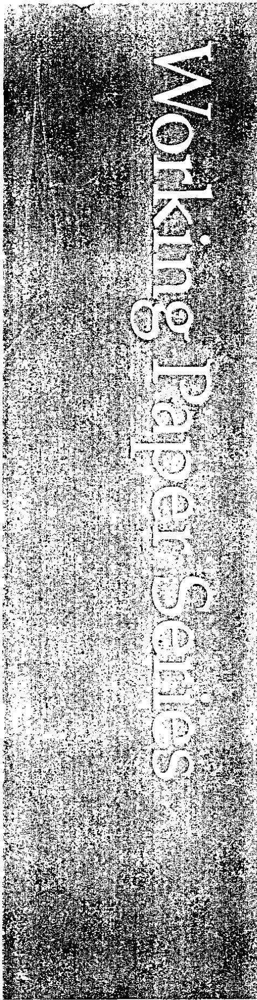

# Bank Contagion: Theory and EvidenceGeorge G. Kaufman

Working Papers SeriesIssues in Financial RegulationResearch DepartmentFederal Reserve Bank of ChicagoJune 1992 (WP- 92- 13)

# George G. Kaufman*

Contagion is a term often used to describe the spillover of the effects of shocks from one or more firms to others.1 It is widely considered to be both more probable to occur in banking than in other industries and to be more serious when it does occur. Bank

* I am indebted to Herbert Baer, George Benston, Eli Brewer, Michael Carchill, Larry Mote and the participants at presentations at Wake Forest University and Florida International University for helpful comments and discussions on earlier drafts.

1. Webster's Dictionary provides three definitions of contagion that appear applicable to the problem discussed in this paper:

1. the spreading of disease from one individual to another by direct or indirect contact. 
5. the spreading of an emotion, idea, custom, etc. from person to person until many are affected: as, the contagion of gaiety. 
6. a bad influence that tends to spread; corruption: as, racial hatred is a contagion.

Webster's New World Dictionary of the American Language, College Edition, Cleveland: World Publishing Co., 1962, p. 318. Alternatively, Calomiris and Gorton define a banking panic to exist in the pre- FDIC era:

when bank debt holders at all or many banks in one banking system suddenly demand that banks convert their debt claims into cash (at par) to such an extent that the banks suspend convertibility of their debt into cash or, in the case of the United States, act collectively to avoid suspension of convertibility by issuing clearing- house loan certificates. Charles W. Calomiris and Gary Gorton "The Origins of Banking Panics: Models, Facts and Bank Regulation," in R. Glenn Hubbard, ed., Financial Markets and Financial Crises, Chicago: University of Chicago Press, 1991, p. 112.

(depository institution) contation is of particular concern for adverse shocks, such as failures, that may be transmitted in domino fashion not only to other banks and the banking system as a whole, but beyond to the entire financial system and the macroeconomy.

The potentially damaging aspects of bank contagion were among the major factors that led Gerald Corrigan, President of the Federal Reserve Bank of New York, among others, to conclude that banks and banking are unique and require government regulation.2 Indeed, much of current public policy towards banking reflects fears about bank contagion, primarily in response to perceptions of the bank debacle during the Great Depression of 1929- 1933. In particular, it is feared that contagion poses a threat to the functioning of the entire financial system. This risk is often referred to as systemic risk.

The magnitude of systemic risk, or the potential damage attributable to contagion from the failure of a large bank, was recently depicted by a member of the Board of Governors of the Federal Reserve System as follows:

It is systemic risk that fails to be controlled and stopped at the inception that is a nightmare condition that is unfair to everybody. The only analogy that I can think of for the failure of a major international institution of great size is a meltdown of a nuclear generating plant like Chernobyl.

The ramifications of that kind of a failure are so broad and happen with such lightening- speed that you cannot after the fact control them. It runs the risk of bringing down other banks, corporations, disrupting

markets, bringing down investment banks along with it. ...We are talking about the failure that could disrupt the whole system. $^{3}$

This paper examines both why contagion is viewed as more serious in banking than in other industries and the empirical evidence in support of this hypothesis.

# Theory

Both theory and a review of the literature suggest that the heightened concern about contagion in banking is attributable to one or more of five factors. The arguments made in support of each of these factors is reviewed in this section. The evidence is reviewed in the next section. In comparison to other industries, absent federal deposit insurance, bank contagion is hypothesized to:

1. occur faster,  
2. spread more broadly within the industry,  
3. result in a larger number of failures,  
4. result in larger losses to creditors (depositors) and,  
5. spread more beyond the banking industry and cause substantial damage to the financial system as a whole and the macro-economy.

Bank contagion occurs faster

Adverse shocks, such as severe financial problems at a bank or

the failure of a bank, are transmitted to other banks primarily through runs, i.e., simultaneous efforts by a large number of demand depositors (and, earlier in history, by note holders) at these banks to exchange their deposits for deposits at other banks or currency at par value. Banks offer large amounts of par value demand debt for a number of reasons, including demand for liquid par value securities by economic agents and the ability of economic agents to monitor bank activities most efficiently through demand debt.4 Runs are the mechanism that spread the germs of contagion. Particularly because of the availability of sophisticated telecommunications and computer technology, such runs can occur almost immediately and without warning upon news of a shock and, because demand debt represents a large percentage of total debt for banks, can produce withdrawals that are large relative to the resources of the bank. To satisfy the depositors, banks generally must sell assets quickly, possibly at fire- sale prices, and/or to borrow funds quickly at high interest rates. In either case, a bank experiencing runs is likely to encounter liquidity problems that could quickly expand into solvency problems if the losses are sufficiently great.

In contrast, spillover from the failure of a nonbank firm or

other adverse news to other firms in the same industry occurs primarily through a reduction in sales revenues or an increase in costs. These firms have proportionately little demand debt that can run in response to news of an adverse shock. Contagious shocks generally involve adverse information about a major product sold by the firm, such as medication that is unsafe or tampered with (Tylenol) or accidents in its use (airplane crashes). Reductions in sales revenues for a few days, even to zero, are unlikely to drive many firms into immediate economic insolvency. The slower speed of the contagion is also likely to provide sufficient warning to potentially affected firms to permit them to prepare a defense to minimize any potential harm.

# Bank contagion is broader within the industry.

Depositors are generally hypothesized to be less informed about the financial condition both of their banks and of other banks in the industry than are creditors of nonbank firms for a number of reasons. One, many depositors have only small claims and thus find credit evaluation of individual institutions relatively costly. Two, many bank assets, liabilities and activities are unique and do not have readily marketable counterparts and some bank activities are cloaked in confidentiality so that information is scarce. As a result, valuing them at market is likely to be more difficult and less accurate and depositors are assumed to view banks as more or less homogeneous, at least with respect to their financial health. Three, because the market values of these activities can change

quickly, costly frequent and possibly even continuous monitoring is required. Four, product and market differences are hypothesized to be less important than in other industries, particularly since the introduction of federal deposit insurance, so that banks are viewed as being more homogeneous. Thus, the failure of one bank or a small group of banks is likely to trigger immediate concerns about the solvency of a large number of other banks, if not all other banks. In addition, the tendency of banks in the U.S. to hold significant corresponding balances with other generally larger banks, particularly because of restrictions on branch banking, operates to interconnect banks directly and to speed transmission of losses from affected banks, particularly larger banks, to other banks. Bank contagion is thus viewed as systematic and leading to banking panics.

In contrast, it is hypothesized that more visible differences exist in products and/or markets among firms in other industries that permit greater differentiation by creditors and customers at less cost. Thus, the failure of any one or small group of firms or adverse news about any major product is less likely to spill over to concern about the solvency of the other firms in the industry. Moreover, by eliminating an important competitor, the failure of any one firm may indeed work to the benefit of the remaining firms.5 It follows that the failure of a bank may also either adversely affect other banks via contagion or benefit them via reducing competition.

Bank contagion results in a larger number of failures.

Banks typically operate with a lower capital to asset ratio than other financial firms and, in particular, nonfinancial firms. For example, in the late 1980's, commercial banks had book value capital- to- asset ratios of near 7 percent, while financial firms other than depository institutions, e.g., insurance and finance companies, had ratios of near 15 percent and nonfinancial firms of near 35 percent6. The lower capital ratios in banking may be attributed in large part to the existence of federal deposit insurance that reduces market discipline by depositors. In addition, the reduced market discipline combined with a premium schedule that is not scaled to the bank's risk exposure encourages banks to pursue riskier portfolio strategies. Because the primary function of capital is to absorb losses so that they are not charged to creditors (depositors) and do not drive the bank into insolvency, a smaller capital ratio provides less protection against failure from a given adverse shock. As a result, a smaller adverse shock can drive a bank into insolvency than other, better capitalized nonbank firms.

Bank contagion results in larger losses to creditors (depositors). Because banks hold lower capital ratios than other firms, given adverse shocks are not only more likely to drive them into insolvency but also to create losses in excess of capital. These

losses must thus be charged against deposits. That is, depositors at banks typically have less protection against comparable adverse shocks than do creditors at other, better capitalized nonbank firms.

Bank contagion extends beyond the banking industry to adversely affect other financial industries and the macroeconomy.

Because bank deposits (and before them bank notes) serve as the largest component of the money supply and money is used to conduct transactions and affects all sectors of the economy, changes in the quantity of deposits directly affect the welfare of individual communities and the macroeconomy. In addition, because deposits are both the most widely held private financial asset and the most liquid part of most households' wealth, losses are likely to have a larger adverse impact on aggregate economic activity than comparable losses in other, riskier financial assets, e.g., stocks. Banks are also the major and most efficient providers of financial intermediation services and disruptions would reduce the quantity and increase the cost of credit to the real sector.7 Lastly, banks operate the nation's payments system and disruptions are likely to both impose losses on participants and reduce the volume of trade. Because banks are the largest financial institution and the heart of the payments system, their financial problems are more likely to spill over to other financial industries, e.g., insurance and finance companies.

How does the spillover to other sectors occur? As discussed earlier, bank contagion occurs through bank runs. Depositors, who doubt the ability of their banks to redeem their deposits on time and in full, are likely to demand immediate transfers to deposits at other, safe banks or to currency. The larger the number of banks under suspicion, the more likely are depositors to choose currency. Although as a liability of the federal government, currency is one hundred percent safe in nominal terms, it is generally viewed as a more costly and inferior way of holding money balances. Which strategy depositors choose matters importantly. Runs to deposits at other banks have no effect on aggregate bank deposits and reserves. They primarily reshuffle deposits and reserves among banks, decreasing them at banks perceived to be weak and increasing them at banks perceived to be safe.8

Depositors may be right or wrong about their perceptions of their banks' financial difficulties. If they are correct and the banks were insolvent or near- insolvent at the time of the run, the run is the result of the problem, not the source of the problem. The run may worsen the problem by forcing the bank to sell its remaining marketable assets more quickly than otherwise and assume larger fire- sale losses. This would increase the losses to depositors or to the deposit insurance agency. But these losses reflect the failure of the regulatory agencies to resolve the bank sooner when its capital first declined to zero.

But, as was hypothesized earlier, because depositors find it difficult to differentiate good banks from bad banks, they are as likely to be wrong as right and the bank could well be economically solvent. Nevertheless, the bank would still have to sell assets quickly to accommodate the run. But, in this scenario, these sales would be unlikely to drive the bank into insolvency. The assets are likely to be relatively liquid and any fire- sale losses small. In addition, it is generally in the best interest of the other banks in the same market area to come to the assistance of the troubled bank to prevent contagion. The assistance takes the form of recycling the funds lost by the bank either by purchasing the bank's assets at their equilibrium rather than fire- sale prices or by lending funds through the Fed funds market at market rates of interest. Thus, the redistribution of deposits is likely to occur with small or no losses to the bank, depositors or the deposit insurance agency and ongoing loan relationships are unlikely to be disrupted greatly. This analysis is basically unchanged if depositors flee to safe nonbank securities, e.g., Treasury securities, rather than to safe banks and if the sellers of the securities redeposit the proceeds in banks. Interest rates on bank and other private securities would, however, increase relative to rates on public securities. This would cause reductions in private investment relative to public investment.

However, if both depositors and the sellers of the safe Treasury securities flee into currency, the problem becomes

substantially more serious. Rather than being merely redistributed, absent an offsetting injection of reserves by the central bank, deposits and reserves are lost to the banking system as a whole. This will result in a multiple contraction in the money supply, in large- scale disruptions in loan relationships and in larger fire- sale losses from the hurried sale of assets by the banks. As nearly all banks are forced from the loss in reserves to contract lending, nearly all banks will be selling loans and few banks will be buying. Consequently, bank failures will be greater in number and losses to the banks, depositors, and deposit insurance agency will be greater in magnitude. (Of course, with credible federal deposit insurance, runs into currency are highly unlikely.) The multiple contractions of money and credit, the disruptions of bank- customer relationships and the large losses to bank depositors are likely to adversely affect activity in other financial sectors as well as in nonfinancial sectors and the macroeconomy as a whole.

Thus, contagion beyond the banking sector is most likely and most severe when depositors question the economic solvency of all or a large number of banks and prefer to hold currency rather than deposits. It is the possibility of runs on individual banks or a small group of banks turning into runs on the banking system as a whole and causing multiple contractions in money and credit and substantial disruptions in loan relationships and the process of

financial intermediation that makes contagion in banking uniquely different from contagion in other industries.

# Evidence

This section reviews the empirical evidence for each of the five factors discussed above.

Bank contagion is faster.

No rigorous empirical evidence has been developed in support of this proposition, although casual empiricism strongly supports it. Media accounts of bank runs in the pre- FDIC days and of post- FDIC runs on individual failed banks, e.g., Franklin National (1974), Continental (1984), Bank of New England (1991), and on nonfederally insured thrift institutions in Ohio, Maryland and Rhode Island indicate that runs on neighboring institutions occurred almost simultaneously with the release of negative news about the financial solvency of an institution. A 1929 American Bankers Association study reported that some 30 percent of individual bank closings were followed by the closing of at least one other neighboring bank within 10 days. About one- half of the closings were only one- day suspensions or were suspensions of banks belonging to the same banking chain as the initially failed banks. The study did not differentiate between banks that closed as a result of contagion and those that closed as a result of failing for the same

reason as the first bank.

A study of a sample of medium- sized banks that failed between November 1930 and March 1933 found that 60 percent of the dollar outflow in total deposits and 70 percent of the dollar outflow in demand deposits up to the date of suspension occurred during the banks' last 30 days of operation, when the most adverse news about the banks' financial condition was likely to be available.11 Casual empiricism based on press reports of runs on banks of various sizes in various parts of the U.S. suggests that runs develop quickly upon the breaking of bad news in the media or elsewhere.

There is even less evidence on the speed of contagion in nonfinancial industries. Casual evidence may be obtained from events such as the Tylenol and other scares involving tampering with the contents of sealed bottles, contaminated milk and other perishables, and airplane crashes. Generally, the affected product or equipment is quickly removed from store shelves or taken out of service. If the product is limited to one brand or company, there is little spillover to other brands or companies. Similarly, except in infrequent circumstances, the other units of the affected equipment remain in service at both the affected company and its competitors. Although not removed off the shelves or taken out of service, sales of the product at competing firms generally do decline until the problem is either identified and corrected or, because repeat cases do not quickly occur, considered to be an

isolated event. But no competing company appears to have suffered immediate reductions in revenues sufficient to have caused significant financial problems.12

Bank contagion is broader within the industry.

A number of recent studies have investigated the effects of both bank failures and adverse surprise announcements, such as unexpected sharp increases in loan loss reserves by an important bank, on the stock returns of other banks. Although these studies measure the speed and breadth at which contagion spreads, they do not measure the resulting failures of other institutions or severity of the losses to depositors. Specifically, these studies analyzed statistically the equity return contagion associated with the failure of the United States National Bank of San Diego in 1973, the Franklin National Bank (New York) in 1974, the Hamilton National Bank (Tennessee) in 197613, the Penn Square Bank (Oklahoma City) in 198214, the Continental Illinois Bank (Chicago) in

198415, the First Republic Bank (Texas) in 198816, three banks in Hong Kong between the years between 1982 and 198517 and the surprise announcement of the Mexican and other Latin American countries' debt crises in 1982 and 198318, the Brazilian debt moratorium in 198719, and the large increase in loan loss reserves against Third World country debt by Citicorp in 1987. 20 With only rare exceptions, these studies report strong evidence that contagion in share returns occurred only for banks in the same market or product area as the initially affected bank. Contrary to widespread popular belief, the market successfully differentiated among banks.

15. Itzhak Swary, "Stock Market Reaction to Regulatory Action in the Continental Illinois Crisis", Journal of Business, July 1986, pp. 451-472 and Larry D. Wall and David R. Peterson, "The Effect of Continental Illinois' Failure on the Performance of Other Banks", Journal of Monetary Economics, August 1990, pp. 77-99.

16. Amy Dickinson, David R. Peterson and William A. Christiansen, "An Empirical Investigation Into The Failure of the First Republic Bank: Is There A Contagion Effect?", Financial Review, August 1991, pp. 303-318.

17. Gerald D. Gay, Stephen G. Timme, and Kenneth Yung, "Bank Failure and Contagion Effects: Evidence from Hong Kong", Journal of Financial Research, Summer, 1991, pp. 153-165.

18. Bradford Cornell and Alan C. Shapiro, "The Reaction of Bank Stock Prices to the International Debt Crisis", Journal of Banking and Finance, March 1986, pp. 55-73 and Michael Smirlock and Howard Kaufold, "Bank Foreign Lending, Mandatory Disclosure Rules, and the Reaction of Bank Stock Prices to the Mexican Debt Crisis", Journal of Business, July 1987, pp. 347-364.

19. James J. Musumeci and Joseph F. Sinkey, Jr., "The International Debt Crisis, Investor Contagion, and Bank Security Returns in 1987: The Brazilian Experience", Journal of Money, Credit and Banking, May 1990, pp. 209-230.

20. Jeff Madura and Wm. R. McDaniel, "Market Reaction to Increased Loan Loss Reserves at Money-Center Banks", Journal of Financial Services Research, December 1989, pp. 359-369.

Strong shocks to one bank or small group of banks did not spill over to other banks randomly or to all banks. Moreover, these studies did not analyze the impact of a bank failure on the insolvency of other banks as opposed to a decline in their equity returns.

Nevertheless, a study of similarities in returns for firms in an industry as a proxy for contagion found that similarities were much greater within banking than within nonbank industries and that contagion was greater in periods of uncertainty and smaller among both banks of different sizes and banks with higher capital ratios.21 In addition, there appears to have been a run to quality during the Continental Bank crisis and rates on CDs at all large banks increased relative to the Treasury bill rate.22 After the end of the crisis, the spreads returned to normal. Although runs are the mechanism that spreads the germs of contagion, runs do not necessarily cause the insolvency of a bank. As discussed earlier, runs may be the consequence rather than the cause of an insolvency as the insolvency often precedes the run. Moreover, with some help from their friends, solvent banks can be expected to survive all but the strongest and most persistent runs. A study of some 3,000 failures of national banks from the enactment of the

National Bank Act in 1864 through 1936 by J.F.T. O'Connor, who was Comptroller of the Currency from 1933 to 1938, reported that runs accounted for less than 10 percent of all causes listed for these failures and less than 15 percent of all failures.23 Similar findings that runs are a relatively minor contributor to insolvencies are reported in a number of other studies.24 Because reports of runs on individual banks have been frequent throughout history, there appear to have been many more runs than resulting failures.

Another indication of the extent of industry- wide contagion is the change in the currency to deposit ratio. As discussed in the previous section, if depositors lose confidence in the ability of a sufficiently large number of banks in the country to redeem their deposits in full and on time, they will run to currency. At such times, there will be an increase in currency and a decline in bank reserves and deposits. A review of U.S. history since the end of the Civil War shows that an annual increase in the currency- deposit ratio accompanied by a decline in deposits occurred in only four periods - - in 1878, 1893, 1908 and 1930- 33.25 But even in these

periods, contagion was not industry- wide. The number of bank failures in 1878 and 1908 were relatively small and during the severe banking crisis of the Great Depression through mid- 1932, 70 percent of all cities with at least one bank experienced no failure, merger or other disruption.26 Since the introduction of federal deposit insurance in 1934, currency runs have been avoided and the likelihood of systemic risk has been reduced to almost zero.

A recent study analyzed contagion among nonbank financial firms, in particular, among money market funds and finance companies.27 The study found little evidence of contagion in consequence of the failure of firms or similar adverse news either in stock market returns or in interest rates paid for funds.

Few studies exist on contagion in nonfinancial industries. A major exception is a recent study by Lang and Stulz, who examined the response in share prices of a sample of firms to the announcement of a bankruptcy by a major firm in the same industry in 41 four digit SIC industry classifications.28 The surviving firms experienced an abnormal decline in their returns around the bankruptcy date both on average for all firms sampled and in 25 of

the 41, or 61 percent, of the industry sectors. Thus, contagion exists for nonfinancial firms as well as for banks. On the other hand, a study of the airline industry found no evidence of serious contagion after air crashes either among airlines or aircraft manufacturers.29

Refining their analysis, Lange and Stulz found that contagion is more prevalent the larger the number of bankruptcies in the industry, the lower the capital ratio (the higher the leverage) and the less nationally concentrated the industry.30 Indeed, in industries with high capital ratios and high concentration, the abnormal returns are positive, that is, the other firms are believed to benefit from the bankruptcy of the initial firm by improving their profitability through extending their market shares and/or increasing their profit margins. Gains from reduced competition outweigh costs from contagion. Because banking has both very low capital ratios and very low national concentration relative to other industries, contagion may be expected to be greater in banking than in other industries. But as noted above, even in banking there is no evidence of industry- wide contagion for periods other than, at most, the Great Depression.

Although similar studies have not been published for banking, casual empiricism suggests similar results in many banking markets

when an insolvent institution is finally resolved. The resolutions frequently resulted in the elimination of above- market interest rates frequently paid on deposits and also below- market rates occasionally charged on loans by insolvent or near- insolvent institutions and forced on their competitors in self- defense.31 Predatory pricing by financially- troubled firms is not unique to banking. Troubled "zombie" airlines and department stores have frequently resorted in recent years to bargain basement prices to maintain their cash flows.

# Bank contagion results in a larger number of failures.

On average, the failure rate for banks has not been greatly different from that for nonbanks. From 1870 through 1989, the annual bank failure rate averaged 0.89 percent, while that for nonfinancial firms averaged 0.77 percent. The bank failure rate exceeded the non- bank rate for a prolonged period only from 1920 through 1933, and then the bank failures from 1920 through 1928 were of only the very smallest banks. But its annual volatility is greater. In crisis years, the number of bank failures increases sharply. In each of the four periods in which a flight- to- currency

was identified, the bank failure rate increased significantly above that for nonbanks. But except for the Great Depression period, the annual failure rate did not exceed 6 percent. These data do not include one- or two- day bank suspensions.

Between 1930 and 1933, the annual bank failure rate averaged near 10 percent. In this period, the nonbank failure rate was only somewhat above 1 percent. In addition, the bank failure rate was greatly in excess of that in any major nonfinancial sector. It was approximately triple the failure rate in manufacturing and mining, which was the hardest hit nonfinancial sector. Unfortunately, a breakdown of failure rates by nonfinancial sectors is not available before 1929.

Thus, it appears that contagion does generally result in a larger number of bank failures than nonbank failures. Nevertheless, the percent of bank failures is relatively small and far from industry- wide. Moreover, in measure, the bank failure rate is as high as it has been because of the unique structure of commercial banking in the U.S., which by law denies many banks the ability to reduce risks as much as possible through geographic and product diversification.

Bank contagion results in larger losses to creditors (depositors). Firm failures may or may not inflict losses on creditors. Only shareholders are guaranteed to lose. The loss to creditors depends on the value of net worth at the time the firm is being resolved. The sooner the failure resolution occurs after a bank's net worth

reaches a zero value, the smaller the losses. Indeed, if the firm were resolved precisely when the market value of its net worth reached zero, losses would be restricted solely to shareholders.

The failure resolution process differs significantly between banks and nonbanks. A chartered depository institution may be declared insolvent and resolved only by the chartering agency - - the Comptroller of the Currency for national commercial banks and the home state banking department for state chartered banks. The criterion used generally focuses on either book value insolvency or failure to operate the bank in a safe and sound manner. Both definitions are vague and leave considerable discretion to the respective chartering agency. In the pre- FDIC days, the chartering agencies' discretion was more restricted. As noted earlier, when depositors feared that their bank(s) were unable to redeem their deposits for deposits at other banks or currency at full and on time, they ran on the bank(s). As a result, the banks frequently encountered liquidity problems and were unable to meet these claims either directly to depositors or to the clearing house when checks were presented for payment. At such a time, the chartering agency automatically suspended the bank until a determination could be made of the bank's solvency. If, after an official examination, the bank was found to be solvent, it was permitted to reopen and continue its operations. If it was not found solvent, it would be granted a limited period of time, e.g., 60 or 90 days, to obtain the necessary capital or be sold, merged or liquidated. A threatening solvency problem quickly led to runs, a liquidity problem and quick

resolution.

But, as noted earlier, most failures occurred for reasons other than runs, e.g., local economic recessions, poor management and fraud. Apparently these insolvencies were discovered by examiners in their regular or special examinations and resolutions may reasonably be expected to have been less prompt than for failures caused by runs and losses to depositors greater.32

The introduction of federal deposit insurance in 1933 changed the rules of the game. By reducing the concern of insured depositors and, in more recent years, some uninsured depositors at banks viewed as "too big to fail" about the solvency of their banks, deposit insurance reduced both the probability and the magnitude of a run on a bank. If the depositor is fully protected, why bother to withdraw deposits? Runs no longer led to the automatic suspension of a bank; economically insolvent banks were able to

continue in operation until legally failed and closed by their chartering agency. Moreover, regulators became less fearful that impaired capital would lead to depositor runs so that quick resolution became less urgent. Particularly in the 1980's, when the sharp jump in the number and asset size of economically insolvent institutions overwhelmed and paralyzed the regulators, economic insolvency and legal failure were frequently separated by substantial time intervals. Book value insolvency generally lags economic insolvency.

The effectiveness of runs or threat of runs in leading to quick closings of insolvent banks may be judged by the magnitude of the losses suffered by depositors. Between 1865 and 1933, losses to depositors as a percent of total deposits at all banks averaged only 0.21 percent per year and less than 1 percent per year even in crisis years.33 A study of failed national banks between 1865 and 1930 put average depositor losses at these banks at near 10 cents on the dollar, disregarding interest losses on delayed payments.34 Since 1934, losses at failed banks have been shared by uninsured depositors and the FDIC. However, because of the resolution procedures used by the FDIC, all depositors have been made whole in all but a few, primarily small failures and the FDIC has absorbed all but a small fraction of the losses. Between 1934 and 1990, the

FDIC reported net losses after recoveries of  $\) 27.5\(billion.$ ^{35} $The losses may be divided into two periods. Less than$ \ $1$  billion, or only 3 percent, occurred in the years before 1981. Fully 97 percent occurred in the 10 years since. As a percent of the assets of resolved failed and assisted banks, losses to the FDIC were less than 2 percent in the period 1950 to 1980 and fully 12 percent in the period 1981 to 1990. These losses, however, understate the true losses to the FDIC as they are not adjusted for interest income lost when recoveries on asset sales occur in later years. Studies of individual bank failures in the late 1980s found that present value losses to the FDIC averaged about 30 cents on the dollar of assets per failed bank. $^{36}$  Losses tended to be considerably greater on small banks than on larger banks.

This evidence indicates that in a world without federal deposit insurance runs were effective both in causing prompt resolution of economically insolvent banks and in minimizing depositor losses. In a world with federal deposit insurance, but few bank failures, the chartering agencies tend to resolve banks quickly after they become at least book value insolvent. However, in a world of federal deposit insurance and many bank insolvencies, as in the

1980s, for a large variety of reasons, regulators forbear and delay for long periods of time before resolving insolvencies.37 As a result, the insolvent banks accrue greater losses that are absorbed by uninsured depositors at some insolvent banks, the FDIC and eventually possibly taxpayers, as in the S&L debacle. Ironically, it appears that it was runs by uninsured depositors that finally forced reluctant regulators to resolve some large banks that were economically but possibly not yet book value insolvent, such as the Continental Illinois Bank in 1984 and Bank of New England in 1991.

Losses to creditors at bankrupt nonbank firms have also been computed. Unlike banks, insolvent nonbank firms are resolved through legal bankruptcy procedures. The firms may be involuntarily forced into bankruptcy by a major creditor, whose payments were not made on schedule, or voluntarily by themselves in anticipation of creditor actions. The primary purpose of the bankruptcy process is to treat all claimants justly and to maximize the proceeds available to the claimants by providing a reasonable opportunity for the firm either to reorganize itself and regain solvency and profitability or to liquidate in an orderly fashion. At first approximation, losses to creditors from insolvency may be measured by the decline from par value in the market value of a firm's debt upon declaration of bankruptcy. A study of losses suffered by bond holders of companies that defaulted between 1971 and 1991 found that

immediately after default the bonds traded on average at near 38 cents on the dollar, or a loss of 62 percent from par value.38 The magnitude of the losses depended, in part, on the initial rating of the bond and on its seniority. The losses were less for bonds with higher ratings. For example, the loss on originally AAA rated bonds averaged 21 cents, and 70 cents on bonds initially rated CCC. Similarly, in the period 1985 to 1991, losses on secured bonds were about 40 cents and on subordinated bonds more than 70 cents. Another study reported that writedowns on debt claims of firms resolved through Chapter 11 bankruptcies between 1983 and 1988 averaged near 50 percent.39 Less rigorous studies for the pre- FDIC period indicate that losses from insolvency at nonbanking firms that went through the bankruptcy process from the Civil War through 1929 averaged near 90 percent.40 These losses are likely to overestimate the losses actually suffered by bond holders as they do not adjust for higher interest rates and other compensation received by the bond holders before the default for assuming the greater risk.

Thus, although contagion may be faster, more widespread, and more likely to drive firms into insolvency in banking than in other industries, losses to creditors appear to be smaller. In part, this

reflects the faster speed of resolution in banking, particularly in the pre- FDIC and early post- FDIC years. Although forbearance by the regulators has slowed the resolution process substantially in the 1980s, it still appears faster than that for nonbanks, on average. Bankruptcy courts appear to have been overly optimistic on average with respect to the ability of insolvent firms to regain solvency and overly liberal with the use of creditors' funds to finance the operations of these firms while in bankruptcy.41 Thus, it appears that bankruptcy courts, in effect, also practice forbearance.42 The relatively more efficient resolution process and the resulting smaller losses suffered by bank creditors than nonbank creditors could help explain the considerably lower capital ratios maintained by banks in both the pre- and post- FDIC periods.43

Bank contagion extends beyond the banking industry.

Bank contagion extends beyond the banking industry when (1) runs on individual banks expand into currency runs on the banking system as a whole so that aggregate money and credit are contracted, (2) the number of bank failures is sufficiently large and their resolution sufficiently delayed to impose large losses on depositors, reducing aggregate liquid wealth substantially, and/or (3) the bank failures break large numbers of ongoing loan customer- bank relationships and significantly increase risk- premiums impounded in loan rates.

As discussed earlier, increases in the currency ratio accompanied by declines in total deposits occurred only rarely in U.S. history and were accompanied by large numbers of bank failures probably only in two periods - - 1893 and 1930- 33. Declines in aggregate money and bank credit in other periods did not result from bank failures. But even in these two periods, available evidence suggests that the ills in the macroeconomy preceded the ills in the banking system so that the primary direction of causation is not from bank contagion to the macroeconomy.44 One study of the timing of bank failures concluded that:

Leading banks hold claims on firms and when firms begin to fail, an indicator of recession (when banks will fail), depositors reassess the riskiness of deposits...Could the causality be reversed in the above conclusions?...This scenario can be eliminated for three reasons...The mechanism of causality running from depositors withdrawing currency from "illiquid" banks and causing businesses to fall is not

present.45

This is not to argue that the effects of bank contagion did not extend beyond the banking industry when a run on the banking system decreased aggregate money and credit, but that, if they did so, they did so very infrequently and the effects reinforced an existing downturn rather than igniting a downturn. Moreover, since the establishment of the Federal Reserve, runs into currency can be offset by an equal Fed injection of reserves and no such runs have occurred since the introduction of the FDIC in 1934. Indeed, as long as federal deposit insurance remains credible, runs into currency appear highly remote. Because losses to depositors at insolvent institutions and breakdowns in loan relationships generally occur concurrently with currency runs and, as discussed above, depositor losses are relatively small, it also appears unlikely that these effects trigger macroeconomic downturns rather than reinforcing them.46 The conclusion appears to be reinforced by comparing the experiences of the United States and Canada during the Great Depression. Between 1929 and 1933, Canada suffered approximately the same percentage declines in business activity, prices and money supply as did the U.S. But, in contrast to the U.S., Canada had no bank runs nor failures. Three possibilities

follow: (1) The banking crisis in the U.S. did not cause the U.S. depression; (2) The Canadian situation would have been even worse if Canada had experienced a banking crisis; or (3) The U.S. banking crisis importantly affected Canada as well as the U.S.47

On the other hand, few have argued and little evidence, even casual, suggests that failure contagion in nonbank and particularly nonfinancial industries has adverse effects that spread much beyond the industry itself, with the possible exception of serious problems in agriculture or foodstuffs. Thus, almost by definition, bank contagion is more likely to spread beyond banking than contagion elsewhere.

# Summary and Conclusions

Runs and contagion are widely feared more in banking than in other industries because of their greater speed and wider impact within the industry, greater losses to creditors (depositors) and the potential spreading of their efforts beyond banking to other financial sectors and the macroeconomy. As a result, banking is subject to unique public policy treatment in the form of legislation and regulation intended to protect the safety of both individual banks and the banking system. However, many of these policies

have been counterproductive, reducing efficiency while failing to enhance safety. Thus, it is important to evaluate both the basis and the evidence for the heightened fears of bank contagion.

Such an analysis suggests that bank contagion is faster; is more likely to spread to a larger proportion of the industry; is likely to lead to a larger percentage of failures, although runs do not appear to drive solvent banks into insolvency; and is more likely to spill over to other sectors than contagion in other industries. Nevertheless, the evidence suggests that the costs of the contagion are not as great as they are publicly perceived to be. Losses to depositor creditors, one of the major fears, are smaller than in nonbank industries. Even at its worst, as in the 1980's, resolution of bank insolvencies appears far more efficient than resolution of nonbank firms through the bankruptcy process. Moreover, losses to bank depositors and the FDIC may be substantially and relatively easily reduced from their high levels of recent years through increasing capital requirements and enforcing the prompt regulatory intervention and reorganization visualized in the FDIC Improvement Act of 1991.48

Aharony, Joseph and Itzhak Swary, "Contagion Effects of Bank Failures: Evidence from Capital Markets", Journal of Business, July 1983, pp. 305- 322.

Altman, Edward I. "Defaults and Returns on High Yield Bonds", Extra Credit, Merrill Lynch, July/August, 1991, pp. 18- 35.

"An Analysis of the Timing of Deposit Reductions Prior to Suspension in a Selected Group of Banks", Federal Reserve Bulletin, June, 1939, pp. 468- 476.

Benson, George J., Robert A. Eisenbeis, Paul M. Horvitz, Edward J. Kane, and George G. Kaufman, Perspectives on Safe and Sound Banking, Cambridge, MA.: MIT Press, 1986.

Benson, George J., and George G. Kaufman, Risk and Solvency Regulation of Depository Institutions: Past Policies and Current Options, New York: Salomon Brothers Center Graduate School of Business, New York University, 1988.

Bernanke, Ben and Mark Gertler, "Agency Costs, Net Worth, and Business Fluctuations", American Economic Review, March 1989, pp. 14- 31.

Bernstein, Aaron et al., "Eastern: The Wings of Greed", Business Week, November 11, 1991, pp. 34- 36.

Bovenzi, John F. and Arthur J. Murton, "Resolution Costs of Failed Banks", FDIC Banking Review, Jan. 1988, pp. 1- 13.

Bradley, Michael and Michael Rosenzweig, "The untenable Case for Chapter 11", Yale Law Journal, March 1992, pp. 1043- 1095.

Calomiris, Charles W. and Gary Gorton, "The Origins of Banking Panics: Models, Facts and Bank Regulation", in Glenn R. Hubbard, ed., Financial Markets and Financial Crises, University of Chicago: Chicago Press, 1991, pp. 109- 173.

Calomiris, Charles W. and Charles M. Kahn, "The Role of Demandable Debt in Restructuring Optimal Banking Arrangements", American Economic Review, June 1991, pp. 497- 513.

Congressional Budget Office, "The Costs of Forbearance During The Thrift Crisis", CBO Staff Memorandum, Washington, D.C., June 1991.

Cook, Douglas O. and Lewis Spellman, "Federal Financial Guarantees and the Occasional Market Pricing of Default Risk:

Evidence from Insured Deposits", Journal of Banking and Finance, December 1991, pp. 1113- 1130.

Cornell, Bradford and Alan C. Shapiro, "The Reaction of Bank Stock Prices to the International Debt Crisis", Journal of Banking and Finance, March 1986, pp. 55- 73.

Corrigan, E. Gerald, "Are Banks Special?" Annual Report 1982, Minneapolis: Federal Reserve Bank of Minneapolis, 1983.

Corrigan, E. Gerald, "Financial Market Structure: A Longer View, New York: Federal Reserve Bank of New York, January 1987.

Cramer, Robert H. and Robert J. Rogowski, "Risk Premia on Negotiable Certificates of Deposit and the Continental Illinois Bank Crisis", Working Paper, Washington State University, 1985.

Diamond, Douglas W., "Financial Intermediation and Delegated Monitoring, Review of Economic Studies, July 1984, pp. 393- 414.

Diamond, Douglas W., and Phillip H. Dybvig, "Bank Runs Liquidity and Deposit Insurance", Journal of Political Economy, June 1983, pp. 401- 19.

Dickinson, Amy, David R. Peterson and William A. Christiansen, "The Effect of Continental Illinois' Failure on the Performance of Other Banks", Journal of Monetary Economics, August 1990, pp. 77- 99.

Easterbrook, Frank H., "Is Corporate Bankruptcy Efficient?" Journal of Financial Economics, October 1990, pp. 411- 417.

Federal Deposit Insurance Corporation, Annual Report, 1940, Washington, D.C.

Federal Deposit Insurance Corporation, 1990 Annual Report, Washington D.C., 1991.

Franks, Julian R., and Walter N. Torous, "How Firms Fare in Workouts and Chapter 11 Reorganizations", Working Paper, University of California at Los Angeles, Revised September 1991.

French, George E., "Early Corrective Action for Troubled Banks", FECC Banking Review, January 1991, pp. 1- 12.

Gay, Gerald D., Stephen G. Timme, and Kenneth Yung, "Bank Failure and Contagion Effects: Evidence from Hong Kong", Journal of Financial Research, Summer, 1991, pp. 153- 165.

Gertler, Mark, "Financial Structure and Aggregate Economic Activity: An Overview", Journal of Money Credit and Banking, August 1988, Pt. II, pp. 559- 588.

Gilson, Stuart C., "Managing Default: Some Evidence on How Firms Choose Between Workouts and Chapter 11" Journal of Applied Corporate Finance, Summer 1991, pp. 62- 70.

Gilson, Stuart C., Kose John and Larry H. P. Lang, "An Empirical Study of Private Reorganization of Firms in Default", Journal of Financial Economics, October 1990, pp. 315- 353.

Gleckman, Howard, "Why Chapter 11 Needs to be Rewritten", Business Week, May 18, 1992, p. 116.

Gorton, Gary, "Banking Panics and Business Cycles", Oxford Economic Papers, December 1988, pp. 751- 781.

Gorton, Gary and George Pennacchi, "Financial Intermediaries and Liquidity Creation", Journal of Finance, March 1990, pp. 49- 71.

Gorton, Gary and George Pennacchi, "Money Market Funds and Finance Companies: Are They the Banks of the Future?", in Michael Klausner and Lawrence J. White eds., Structural Change in Banking, Homewood, IL; Irwin Publishing, (forthcoming).

Haubrich, Joseph, "Non- Monetary Effects of Financial Crises: Lessons From the Great Depression in Canada", Journal of Monetary Economics, March 1990, pp. 223- 252.

Hubbard, R. Glenn, ed., Financial Markets and Financial Crises, Chicago: University of Chicago Press, 1991.

James, Christopher, "The Losses Realized in Bank Failures", Journal of Finance, September 1991, pp. 1223- 1242.

Jensen, Michael C., "Corporate Control and the Politics of Finance", Journal of Applied Corporate Finance, Summer 1991, pp. 15- 33.

Jones, Homer, "An Appraisal of the Rules and Procedures of Bank Supervision, 1929- 39", Journal of Political Economy, April 1940, pp. 183- 184.

Kane, Edward J., The S&L Insurance Mess, Washington D.C.: Urban Institute, 1989.

Kaufman, George G., "Capital in Banking: Past, Present, and Future", Journal of Financial Services Research, April 1992, pp. 385- 402.

Kaufman, George G., "Are Some Banks Too Large To Fail? Myth and Reality", Contemporary Policy Issues, October 1990, pp. 1- 14.

Kryzanowski, Lawrence and Gordon S. Roberts, "The Performance of the Canadian Banking System, 1920- 1940", Banking System Risk:

Chartering a New Course, Chicago: Federal Reserve Bank of Chicago, May 1989, pp. 221- 232.

Lamy, Robert E. and G. Rodney Thompson, "Penn Square, Problem Loans and Insolvency Risk", Journal of Financial Research, Summer 1986, pp. 103- 112.

Lang, Larry H. and Rene M. Stultz, "Contagion and Competitive Intra- Industry Effects of Bankruptcy Announcements", Working Paper, Ohio State University, January 1992.

LaWare, John, "Testimony" in U.S. Congress, Subcommittee on Economic Stabilization of the Committee on Banking, Finance and Urban Affairs, U.S. House of Representatives, Economic Implications of the "Too Big to Fail" Policy: Hearings, May 9, 1991, (102nd Congress, 1st session).

Lawrence, Joseph Stagg, "What is the Average Recovery of Depositors?", American Bankers Association Journal, February 1931, pp. 655- 556, 722- 23.

Madura, Jeff and Wm. R. McDaniel. "Market Reaction to Increased Loan Loss Reserves at Money- Center Banks" Journal of Financial Services Research, December 1989, pp. 359- 369.

Mishkin, Frederic H., "Asymmetric Information and Financial Crisis" A Historical Perspective in Glenn R Hubbard, ed. Financial Markets and Financial Crises, University of Chicago: Chicago Press, 1991, pp. 69- 108.

Musumeci, James J., and Joseph F. Sinkey, Jr., "The International Debt Crisis, Investor Contagion, and Bank Security Returns in 1987: The Brazilian Experience", Journal of Money, Credit and Banking, May 1990, pp. 209- 230.

"No Banking Adjustment in 68% of all Cities and Towns", Banking Monthly, October 1932, pp. 585- 588.

O'Conner, J.F.T., The Banking Crisis and Recovery Under the Roosevelt Administration, Chicago: Callaghan and Co., 1938.

Peavy, John W. III, and George H. Hempel, "The Penn Square Bank Failure", Journal of Banking and Finance, March 1988, pp. 141- 150.

Pozdena, Randall J., "Is Banking Really Prone to Panics?", FRBSF Weekly Letter, Federal Reserve Bank of San Francisco, October 11, 1991.

Rose, Nancy L., "Fear of Flying? Economic Analyses of Airline Safety", Journal of Economic Perspectives, Spring 1992, pp. 87- 93.

Schwartz, Anna J., "The Lender of Last Resort and the Federal

Safety Net", Journal of Financial Services Research, September 1987, pp. 1- 18.

Shadow Financial Regulatory Committee, "An Outline of a Program for Deposit Insurance and Regulatory Reform" (Statement No. 41), February 13, 1989.

Short, Genie D. and Jeffery W. Gunther, "The Texas Thrift Situation: Implications for the Texas Financial Industry", Financial Industry Studies, Federal Reserve Bank of Dallas, September 1988.

Short, Genie D. and Kenneth J. Robinson, "Deposit Insurance Reform in the Post- FIREA Environment", Consumer Finance Law Quarterly Report, Spring 1991, pp. 128- 134.

Smirlock, Michael and Howard Kaufold, "Bank Foreign Lending, Mandatory Disclosure Rules and the Reaction of Bank Stock Prices to the Mexican Debt Crisis", Journal of Business, July 1987, pp. 347- 364.

Swary, Itzach, "Stock Market Reaction to Regulatory Action in the Continental Illinois Crisis", Journal of Business, July 1986, pp. 451- 473.

Thornycke, G., "Fiction and Fact on Bank runs", American Bankers Association Journal, June 1929, pp. 1222, 1268- 1269.

Wall, Larry D., and David R. Peterson, "The Effect of Continental Illinois's Failure on the Financial Performance of Other Banks", Working Paper, Federal Reserve Bank of Atlanta, December 1989.

Wall, Larry D., David R. Peterson and William A. Christiansen, "An Empirical Investigation Into the Failure of the First Republic Bank: Is There a Contagion Effect?", Financial Review, August 1991, pp. 303- 318.

Webster's New World Dictionary of the American Language, College Edition, Cleveland: World Publishing Co., 1962.

White, Michelle J., "The Corporate Bankruptcy Decision", Journal of Economic Perspectives, Spring 1989, pp. 129- 151.

# Working Paper Series

Working Paper SeriesA series of research studies on regional economic issues relating to the Seventh Federal Reserve District, and on financial and economic topics.

# REGIONAL ECONOMIC ISSUES

Construction of Input- Output Coefficients with Flexible Functional Forms WP- 90- 1 Philip R.Israilevich

Regional Regulatory Effects on Bank Efficiency WP- 90- 4 Douglas D.Evanoff and Philip R.Israilevich

Regional Growth and Development Theory: Summary and Evaluation WP- 90- 5 Geoffrey J.D.Hewings

Institutional Rigidities as Barriers to Regional Growth: A Midwest Perspective WP- 90- 6 Michael Kendix

Census Content of Bureau of Economic Analysis Input- Output Data WP- 91- 2 Philip R.Israilevich,Randall W.Jackson and Jon Comer

Calibrating Manufacturing Decline in the Midwest: Valued Added, Gross State Product, and all Points Between WP- 91- 8 William A.Testa and David D.Weiss

The Midwest Economy: Quantifying Growth and Diversification in the 1980's WP- 91- 12 Robert H.Schonbus and David D.Weiss

Issues in State Taxation of Banks WP- 91- 17 Richard H.Mattoon

Job Flight and the Airline Industry: The Economic Impact of Airports on Chicago and Other Metro Areas WP- 92- 1 William A.Testa

Working paper series continued

Working paper series continuedEstimating Monthly Regional Value Added by Combining Regional Input With National Production Data Philip R. Israilevich and Kenneth N. Kuttner

Local Impact of Foreign Trade Zone David D.Weiss

# ISSUES IN FINANCIAL REGULATION

Payments System Risk Issues on a Global Economy Herbert L.Baer and Douglas D.Evanoff

Deregulation, Cost Economies and Allocative Efficiency of Large Commercial Banks Douglas D.Evanoff and Philip R.Israilevich

Evidence on the Impact of Futures Margin Specifications on the Performance of Futures and Cash Markets James T.Moser

Capital Banking: Past, Present and Future George G.Kaufman

The Diminishing Role of Commercial Banking in the U.S. George G.Kaufman

Optimal Contingent Bank Liquidation Under Moral Hazard Charles W.Calomiris,Charles M.Kahn, and Stefan Krasa

Scale Elasticity and Efficiency For U.S.Banks Douglas D.Evanoff and Philip Israilevich

An Empirical Test of the Incentive Effects of Deposit Insurance: The Case of Junk Bonds at Savings and Loan Association Elijah Brewer III and Thomas Mondschean

Capital in Banking: Past, Present and Future George G.Kaufman

WP- 92- 8

WP- 92- 9

WP- 90- 19

WP- 90- 20

WP- 91- 10

WP- 91- 11

WP- 91- 13

WP- 91- 15

WP- 91- 18

WP- 91- 10

Working paper series conjunued

The Diminishing Role of Commercial Banking in the U.S.  George G. Kaufman

Incentive Conflict in Deposit- Institution Regulation: Evidence from Australia  Edward J. Kane and George G. Kaufman

Capital Adequacy and the Growth of U.S. Banks  Herbert Baer and John McElravey

WP- 92- 11

Bank Contagion: Theory and Evidence  George G. Kaufman

WP- 92- 13

# MACRO ECONOMIC ISSUES

Unit Roots in Real GNP: Do We Know, and Do We Can?  Lawrence J. Christiano and Martin Eichenbaum

WP- 90- 2

Money Supply Announcements and the Market's Perception of Federal Reserve Policy  Steven Strongin and Vefa Tarhan

WP- 90- 3

Sectoral Shifts in Interwar Britain  Prakash Loungani and Mark Rush

WP- 90- 7

Money, Output, and Inflation: Testing the P- Star Restrictions  Kenneth N. Kuttner

WP- 90- 8

Current Real Business Cycle Theories and Aggregate Labor Market Fluctuations  Lawrence J. Christiano and Martin Eichenbaum

WP- 90- 9

The Output, Employment, and Interest Rate Effects of Government Consumption  S. Rao Aiyagari, Lawrence J. Christiano and Martin Eichenbaum

WP- 90- 10

Money, Income, Prices and Interest Rates after the 1980s  Benjamin M. Friedman and Kenneth N. Kuttner

WP- 90- 11

Working paper series continued

Real Business Cycle Theory: Wisdom or Whimsy? WP- 90- 13  Martin Eichenbaum

Macroeconomic Models and the Term Structure of Interest Rates  WP- 90- 14  Steven Strongin

Stock Market Dispersion and Real Economic Activity: Evidence from Quarterly Data  WP- 90- 15  Prakash Loungani, Mark Rush and William Tave

Term- Structure Spreads, The Money Supply Mechanism, and Indicators of Monetary Policy  WP- 90- 16  Robert D. Laurent

Another Look at the Evidence on Money- Income Causality  WP- 90- 17  Benjamin M. Friedman and Kenneth N. Kuttner

Investment Smoothing with Working Capital: New Evidence on the Impact of Financial Constraints  WP- 90- 18  Steven Fazzari and Bruce Petersen

Structural Unemployment and Public Policy in Interwar Britain: A Review Essay  WP- 91- 1  Prakash Loungani

A Simple Estimator of Cointegrating Vectors in Higher Order Integrated Systems  WP- 91- 3  James H. Stock and Mark W. Watson

Stochastic Trends and Economic Fluctuations  WP- 91- 4  Robert G. King, Charles I. Plosser, James H. Stock and Mark W. Watson

Gross Job Creation, Gross Job Destruction and Employment Reallocation  WP- 91- 5  Steve J. Davis and John Haliwanger

The Role of Energy in Real Business Cycle Models  WP- 91- 6  In- Moo Kim and Prakash Loungani

Investment and Market Power  Paula R. Worthington

WP- 91- 6

WP- 91- 7

Working paper series continued

Measures of Fit for Calibrated Models Mark W. Watson

WP- 91- 9

Using Noisy Indicators to Measure Potential Output Kenneth N. Kuttner

WP- 91- 14

Why Does the Paper- Bill Spread Predict Real Economic Activity? Benjamin H. Friedman, Kenneth N. Kuttner

WP- 91- 16

Market Structure, Technology and the Cyclicity Output Bruce Petersen and Steven Strongin

WP- 91- 19

Seasonal Solow Residuals and Christmas: A Case for Labor Hoarding and Increasing Returns R. Anton Braun and Charles L. Evans

WP- 91- 20

The Effect of Changes in Reserve Requirements on Investment and GNP Prakash Loungani and Mark Rush

WP- 91- 21

Productivity Shocks and Real Business Cycles Charles L. Evans

WP- 91- 22

Seasonality and Equilibrium Business Cycle Theories R. Anton Braun and Charles L. Evans

WP- 91- 23

The Identification of Monetary Policy Disturbances: Explaining the Liquidity Puzzle Steven Strongin

WP- 91- 24

R&D and Internal Finance: A Panel Study of Small Firms in High- Tech Industries Charles P. Himmelberg and Bruce C. Petersen

WP- 91- 25

Sticky Pricos: New Evidence from Retail Catalogs Anil K. Kashyap

WP- 91- 26

Working paper series continued

Internal Net Worth and the Investment Process: WP- 91- 27 An Application to U.S. Agriculture R. Glenn Hubbard and Anil K. Kashyap

An Examination of Change in Energy Dependence and Efficiency in the Six Largest Energy Using Countries- - 1970- 1988 WP- 92- 2 Jack L. Hervey

Does the Federal Reserve Affect Asset Prices? WP- 92- 3 Vefa Tarhan

Investment and Market Imperfections in the U.S. Manufacturing Sector WP- 92- 4 Paula R. Worthington

Business Cycle Durations and Postwar Stabilization of the U.S. Economy WP- 92- 6 Mark W. Watson

A Procedure for Predicting Recessions with Leading Indicators: Econometric Issues and Recent Performance WP- 92- 7 James H. Stock and Mark W. Watson

Production and Inventory Control at the General Motors Corporation During the 1920s and 1930s WP- 92- 10 Anil K. Kashyap and David W. Wilcox