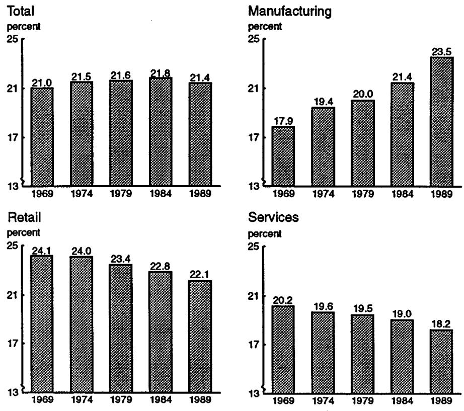
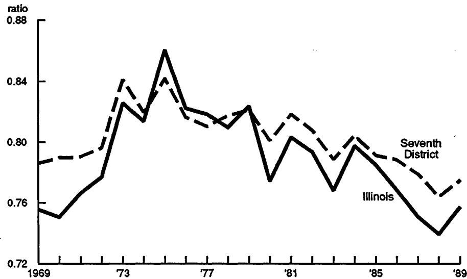
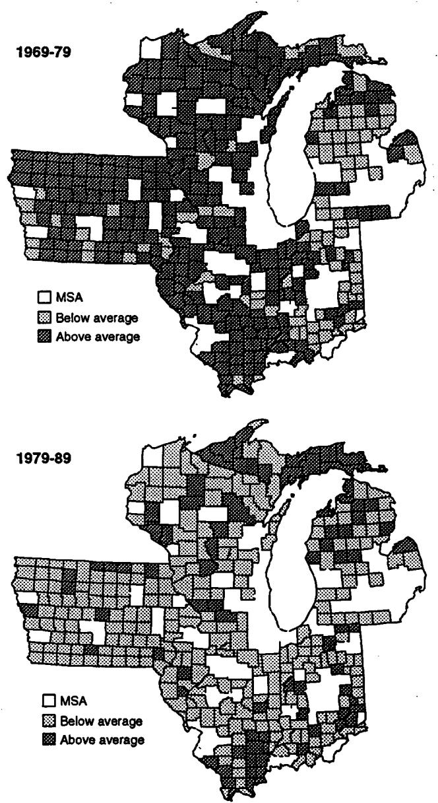
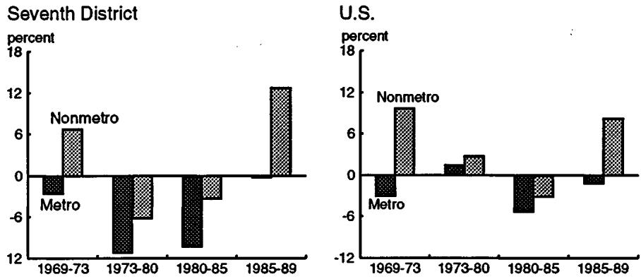
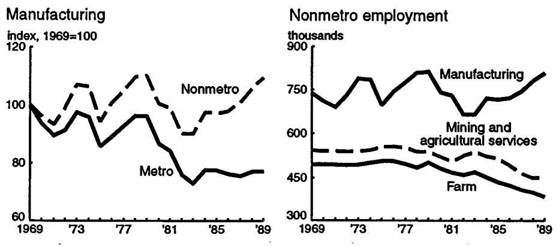
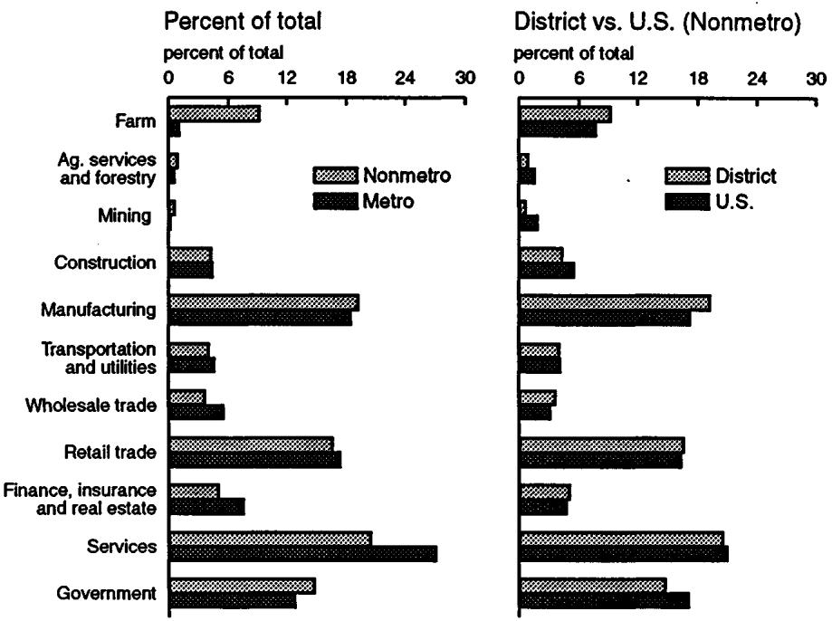
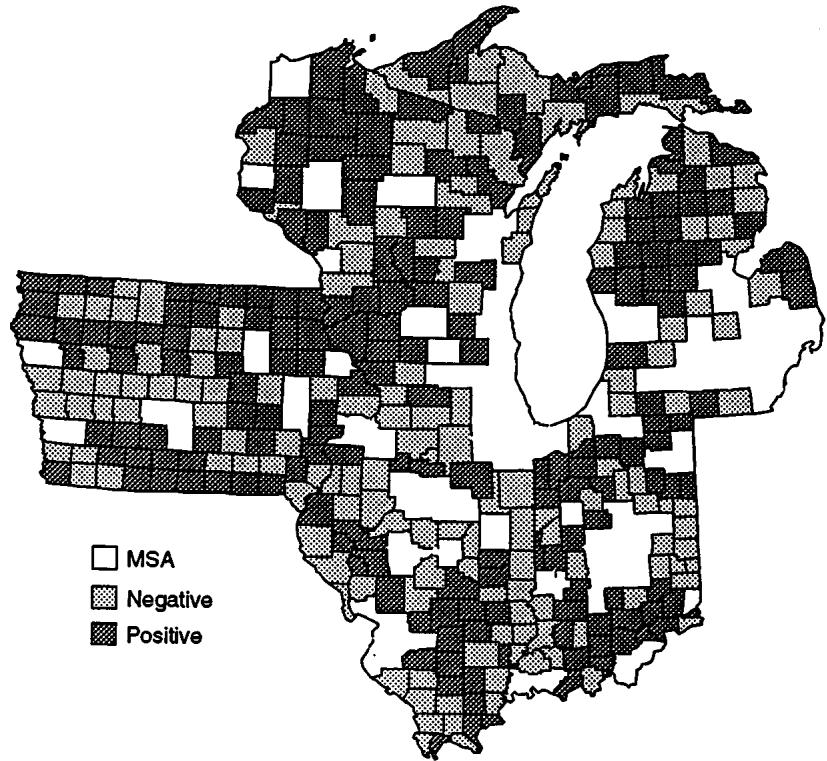
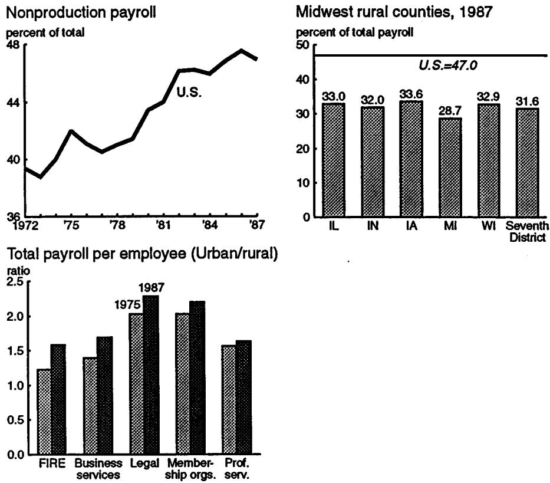
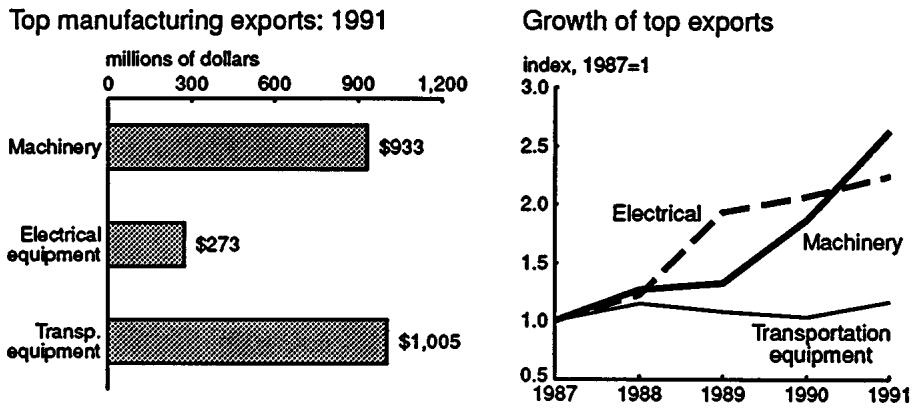

# REGIONAL ECONOMIC ISSUES

Working Paper Series

Trends and Prospects for Rural Manufacturing

William A. Testa

# Trends and Prospects for Rural Manufacturing

William A. Testa*

Manufacturing has become the primary economic base for many nonmetropolitan counties in both the Midwest and in the rest of the nation.At the same time, services, retail and other industries are abandoning remote counties and are moving up the urban hierarchy and centralizing rather than decentralizing (Figure 1; see Appendix I for Figures).And while the farm sector's health has now stabilized following the downslide of the early 1980s, farm jobs- - especially those as a full- time occupation- - continue to disappear as the average size of a farm needed to support today's American family continues to grow larger.In sum, as one writer has put it, "many small rural towns... have been transformed from farm service centers into minor cogs in the national manufacturing system."1

Manufacturing's rising importance in rural areas has been going on for several decades and it will probably continue to outpace other "basic" industry sectors in the rural Midwest.However, several forces of change which began to unfold in the 1980s and which are expected to continue into the 1990s, are not so favorable.These changes impacting rural manufacturing are three fold:

Manufacturing is undergoing a transition from traditional assembly line modes of production, i.e.from "post- Fordism", to what is being called "flexible manufacturing systems".This change in the organization and mode of production is believed by some to favor urban locales over rural areas as production sites.Rural manufacturing differs from its urban counterpart in being more production oriented and less service oriented in the particular activities that manufacturing companies engage

in.(Service activities of manufacturing companies include corporate headquarters, general administration, and R&D).However, because U.S. manufacturing companies are themselves becoming more service oriented, we would not expect that manufacturing in rural areas will fare as well.

Ongoing negotiations between Mexico, Canada, and the United States are moving toward a tariff free trading area as defined in the pending North American Free Trade Agreement (NAFTA).As a result, low skill or low value added jobs (which tend to be found in rural areas) are those that are more likely to flee U.S. borders to Mexico.

# The changing economic base of nonmetropolitan counties

Generally speaking, the primary challenge of rural areas during this century has been to replace job loss arising from the decline in the labor needs of natural resource industries.As productivity climbs in farming and mining, or as natural resources are exhausted in forest and fisheries, the release of labor into other sectors or the outright loss of jobs is the result.

Prior to the 1980s, the decentralization of manufacturing to rural areas tended to create enough jobs to replace those lost in the natural resource and agricultural sectors.Coupled with outmigration from rural areas, this has resulted in a convergence in per capita income between metropolitan and nonmetropolitan counties (Figure 2).2 Outperformance of urban counties by individual rural counties can be seen for individual counties in the 1970s (Figure 3) for the Seventh District states of Illinois, Indiana, Iowa, Michigan, and Wisconsin.The convergence toward equal per capita incomes came to a halt during the 1980s as both agriculture and natural resource industries such as mining, energy production, and forestry fell on hard times.

Manufacturing located in both urban and rural areas alike fell onto hard times during the 1980s, but rural performance continued to outpace urban

performance in job creation over the decade in both the Seventh District and the nation (Figures 4 and 5).Outperformance by rural counties (in the U.S.) with regard to manufacturing job growth has been shown to extend at least back into the 1950s and 1960s (Carlino 1985).Moreover, the contention that manufacturing job growth merely represents an urban "sphloven effect" of the suburbanization of manufacturing jobs to the outlying counties of large metropolitan areas has also been found to be mistaken, inconclusive, or at least nonpervasive from decade to decade [Carlino (1985); Haynes and Machunda, (1990)].Rural counties that are not even adjacent to metropolitan areas have been found to be experiencing buoyant or above average manufacturing job growth.As shown in the table below, the rate of job growth in nonadjacent nonmetropolitan counties in Seventh District states greatly exceeded metropolitan counties in both the 1969- 79 and 1979- 89 periods.In addition, nonadjacent growth exceeded adjacent job growth during the 1969- 79 period.

Table 1 Percent job growth in manufacturing in Seventh District States by type of county

<table><tr><td></td><td>1969-79</td><td>1979-89</td><td>1969-89</td></tr><tr><td>Metropolitan</td><td>-4.1</td><td>-19.2</td><td>-22.5</td></tr><tr><td>Nonmetropolitan adjacent</td><td>8.6</td><td>.3</td><td>8.9</td></tr><tr><td>nonadjacent</td><td>12.2</td><td>-1.9</td><td>10.1</td></tr></table>

Source: U.S. Department of Commerce, Bureau of Economic Analysis.

The causes of this re- orientation of manufacturing from large urban areas to rural areas are not difficult to trace.As U.S. factory productivity increased sharply during this century, manufacturing no longer required as large an assembly of workers.More modest "factory neighborhoods" of workers could be gathered on a smaller scale than those previously found in large cities.In addition, the assembly line methods of production which gained popularity following Henry Ford's success in automotive production required larger amounts of space so as to organize production efficiently.Accordingly, the multi- story urban factory increasingly gave way to one story sprawling production buildings.But this also meant that the cheaper land costs of suburban and rural sites became more important in the production cost equation.Finally, the transportation system changed from rail lines

converging on a central terminus- - e.g.Chicago- - to a grid of interstate highways reaching deep into remote areas such as Appalachia and Texarkana.Rather than shipping manufactured goods from a central terminal such as Chicago, a remote branch plant could serve wide market areas almost as well in shipping to distant regions.Often, labor could be purchased more cheaply in distant regions and was unfettered by restrictive work rules.At the same time, the evolution away from producing heavy manufactured goods such as steel (which required bulky inputs of coal and ore), toward lighter goods such as computers and plastics, also dispersed manufacturing toward those locales where the transportation penalty of remoteness was not so severe.

The upshot of these changes has been that, as manufacturing job growth in rural counties outpaced growth in the large urban areas, manufacturing has become a staple of the job composition in rural counties.In the Seventh District for example, manufacturing's share of total employment in nonmetropolitan counties exceeds the share in metropolitan areas (Figure 6).In addition, rural counties in the Seventh District states have a larger share of manufacturing in comparison to their U.S. counterparts; manufacturing employment in District counties accounts for 19.2 percent of total employment versus 17.2 percent nationally.

Not all nonmetropolitan counties have fared well in the 1980s with regard to manufacturing job growth (Figure 7).This suggests that active development policies in rural areas may be needed if this growth direction is to be realized.This is especially so owing to several trends that may now be working counter to the rural edge in manufacturing observed during recent decades.These trends are discussed in the following sections.

# Manufacturing and Services

Many of the same forces affecting location decisions with regard to service firms- - especially business services or producer services firms which sell their services to other firms rather than to consumers- - also have a bearing on manufacturing companies.The reasons for this are that, aside from plant production activities, manufacturing companies carry out many service activities such as research and development, design, management, sales, and distribution [Israelovich and Testa (1989)].To varying degrees, manufacturing industries and companies can be thought of as an amalgam of service and production activities so that those locational forces that motivate service companies will, to varying degrees, also motivate manufacturing

companies.By the same token, service activities and production- type or plant- type activities will respond to differing locational pulls.As a result, the service intensity of any particular manufacturing company or industry will help to determine its locational preferences.

Service industries- especially the rapidly growing (and higher paying) producer service industries such as advertising, specialized financial, and management consulting- have thrived and concentrated in large urbanized areas rather than in rural counties.More importantly, as an indicator of future manufacturing trends, the centralization of producer services into urbanized areas accelerated during the 1980s [Testa (1992)].Similar to producer service jobs, nonproduction jobs of manufacturing companies have come to favor more urban areas over rural counties.A look at nonmetropolitan counties in the Seventh District shows that, in comparison to the 47 percent nonproduction payroll of manufacturers in the U.S., rural counties hover at just over 30 percent in nonproduction (Figure 8).

Some of the advantages for producer services in large urban areas have been:

1) Highly developed transportation systems which help in bringing people and clients in to market; and also help in shipping service agents out.The increasing advantage of air transport which is held by large urban areas was strengthened by deregulation of that industry in the late 1970s and by the rapid growth of passenger mega-hubs such as Dallas-Ft. Worth, Atlanta, and Chicago.

2) Highly skilled and educated workers find large labor markets more lucrative for several reasons.A greater degree of specialization in these activities and professions accompanied by higher wages and productivity can be achieved at a larger scale and broader scope of operation.In addition, two-worker families, which have increased along with the rising labor force

participation of females, are even more likely to find suitable occupational opportunities within large labor sheds.

3) According to recent studies, improvements in telecommunications technology such as facsimile machines, teleconferencing, and other fiber optics transmission have probably strengthened the advantages of large urban areas over rural counties.These improvements are proving to be complements rather than substitutes for centralized business service provision, that is, it is now easier to transmit or deliver services to remote locations; and more efficient to do so from a centralized and (usually) urban locale.

At the same time that service activities are growing in stature, the actual activities and jobs of manufacturing companies are themselves becoming more service oriented.Production or so- called blue collar jobs inside of manufacturing companies continue to dwindle at the same time that jobs such as R&D, clerical, computer programing and data processing, advertising, accounting, and strategic planning are becoming more plentiful.Nonproduction payroll by manufacturing companies in the United States has increased from 39 to 47 percent over the 1972- 87 period.

From the 1970s to the 1980s, and similar to services, the gap between nonproduction payroll per worker in rural counties and that in urban counties has widened (Figure 8).This reflects trends favorable to high- paying service functions concentrating in urban locales.In particular, the demand for labor in such industries and occupations strengthened in relation to demand in less urbanized areas.

The trend toward greater service orientation among manufacturers, coupled with the impetus to concentrate service activities in large urban areas, has exerted a drag on the expansion of manufacturing employment in rural areas

during the 1980s.Drawing on data from the Census Bureau from 1980 to 1988, McGranahan finds that a tremendous shift in job composition occurred in nonmetropolitan versus metropolitan areas within the manufacturing sector (1992).Within nonmetropolitan counties, both management- research and support type jobs declined while production jobs increased slightly.In contrast, management- research jobs in metropolitan counties soared (by over 30 percent) while production jobs fell by over 10 percent.By implication, insofar as such production jobs share of employment in manufacturing is decreasing, the rural advantage in production activities will be less capable of buoying income and employment in nonmetropolitan counties.

# Flexible manufacturing

Manufacturing industries are reportedly changing their management and production methods towards "flexible manufacturing" or "flexible specialization" [Piore and Sabel (1984); Scott (1986)].4 U.S. auto makers are perhaps the most prominent industry who have, somewhat belatedly, adopted new organizational techniques which are predicated on Japanese innovations.GM, Chrysler, and Ford have adopted these technologies through joint ventures with Japanese car makers (Toyota, Mitsubishi, and Mazda respectively) and are now adopting many organizational changes throughout their organization or at least within divisions (for example, Saturn of GM).In addition, other U.S. industries including photocopiers, cameras, and calculators have changed their relationships with suppliers following the Japanese prototype [Linge (1991)].

Some characteristics of flexible manufacturing are:

1) relationships with a smaller number of key suppliers.The supplier relationship can be characterized as closely knit and cooperative with regard to capital investment, sharing of technology, and input to design, rather than purely contractual in nature;

2) smaller production runs and a more varied or customized product;

3) less heirarchal and more participatory organization of employees ranging from the production line to management and sales activities;

4) use of equipment such as flexible manufacturing systems that are capable of changing the production line in short order;

5) maintenance of "lean" inventories and the use of "just in time" delivery of inputs and parts which must be manned by more highly skilled and trained workers.

Some analysts believe that the adoption of these production methods will work to the disfavor of manufacturing in rural areas because:

1) skilled and high wage labor tend to be found in urban areas;

2) flexible specialization usually implies a smaller scale of operation (there is a lesser need for the cheap and plentiful rural land);

3) the greater need for communication/innovation amongst employees may favor urbanized areas where the flow and exchange of information can be conducted on a greater scale and at lower cost.Close proximity promotes close and cooperative relations between assembly operations and key suppliers, and cuts down on delivery and inventory costs.

Despite these disadvantages, there is also a growing body of argument and evidence to suggest that rural areas will not necessarily wither because of the technological transition toward flexible manufacturing systems.First, the alleged benefits of close and dense proximity as it relates to flows of information may not be universal.Experience in other countries such as the peripheral Jutland area of Denmark [Niles Hansen (1991)] has illustrated that a critical mass of interlinked and cooperating manufacturers who practice flexible methods can be assembled in rural areas.More importantly, areas such as peripheral Jutland highlight the fact that rural areas need not find their success solely through the accepted but tired paradigm of the rural area as the home of the routinized branch manufacturing plant.For Jutland, rather than the tail end of the "product cycle", a culture of entrepreneurs and cooperation between smaller manufacturers has given rise to both large numbers of jobs and to high value added- - even high tech- - jobs as well.

Close physical proximity has also been cited as advantageous because it facilitates "just in time" delivery of parts and components from suppliers, and thereby economizes on delivery and inventory costs.However, a "growing separation of assembly plants from their subcontractors has also been facilitated by the parallel growth of specialist freight handling firms with national and international multi- modal networks which have considerably reduced the tyranny of distance."In comparison to most other industrialized nations, many rural regions of the Midwest have access to the interstate highway system which greatly shortens the time- distance from rural factories to their markets.

Similarly, enhancements in communications have made it easier for multistate and multinational manufacturing companies to organize and coordinate production across long distances between assembly plants, components suppliers, and distribution centers [Glasmier (1991)].In the past, U.S. rural areas have benefited from the process by which companies established far flung branch plants in rural areas in order to take advantage of lower costs of labor, land, and taxes.Recent advances in telecommunications would appear to assist this branching process by which companies move their more routinized and less customized product lines or components to peripheral areas of the U.S. or alternatively, overseas.

With regard to the skilled labor advantages of urbanized areas, it can be argued that the new (flexible) production and organizational techniques actually favor rural areas over urban counties.That is partly because the need for flexibility in work assignments may be difficult to achieve in urban

counties where the influence of strong labor unions may resist flexible work assignments.For example, in the American Midwest, Daniel Knudsen et al (1991) report in a series of case studies that unions dislike so- called "flexible labor cells" (where the labor resource is maximized in production) because they are viewed as threatening to the seniority system and are thought to be a device to encourage "speed- up" of the work process.Accordingly, the location decisions of many Japanese manufacturers (who were among the pioneers of flexible methods) such as Honda at Marysville and East Liberty, Ohio, and especially Toyota at Georgetown, Kentucky, have favored rural (less union oriented) locales.These manufacturers have trained workers in both job skills and corporate culture.

Nor has it been established with certainty that there is any underlying rural skills deficit which would act as a labor supply impediment in the location decision of flexible manufacturers.Statistics reporting years of education completed do show that the adult population of U.S. nonmetro counties is below the national average; but this does not necessarily reflect a shortage of skilled workers facing prospective manufacturers.Rather, the lower stock of educational attainment may reflect an historical lack of skilled job opportunities in rural areas which has induced a migration of younger and educated workers out of rural areas and into large urban areas especially.David A. McGranahan and Linda A. Ghelfi (1991) review the evidence of the rural economic stagnation of the 1980s against the backdrop of the increased national demand for educated workers during the 1980s.The authors conclude that lagging rural job growth was not driven by faltering labor supply in rural areas but rather that a surging demand for skilled workers occurred in urban areas which accelerated rural outmigration and widened the rural/urban wage gap.Furthermore, the educational gap between nonrural and rural areas is significantly larger for college education than for high school [Swain and Teixeira (1991)], which is most likely to be the level of education which manufacturers would tend to demand of prospective production workers.Moreover, the authors report that the rural deficit for high school completion among adults has been falling- - from 8.1 percentage points in 1971 to 4.4 percentage points by 1987.

Likewise, while national statistics report lagging academic achievements of rural students, there is much variation across regions with the rural South largely accounting for sub- par rural deficit nationwide.Swain and Teixeira (1991) report that high school drop out rates among 18- 21 year olds in the nonmetro counties of the Midwest were below both metro and nonmetro counties of the Northeast, West, and South in 1985.High school graduation

attainment rates reported from the 1980 Census of Population for Seventh District states reveal that nonmetro counties are not much different in producing high school graduates in comparison to both its own urban areas and to national averages (Table 2).

Table 2 High school completion rates for young adults, 1980

<table><tr><td></td><td>Total urban</td><td>Central cities</td><td>Urban fringe</td><td>Total rural</td><td>Farm</td><td>All areas</td></tr><tr><td>Illinois</td><td>.78</td><td>.73</td><td>.81</td><td>.78</td><td>.84</td><td>.78</td></tr><tr><td>Indiana</td><td>.77</td><td>.78</td><td>.78</td><td>.72</td><td>.76</td><td>.76</td></tr><tr><td>Iowa</td><td>.82</td><td>.82</td><td>.83</td><td>.77</td><td>.79</td><td>.81</td></tr><tr><td>Michigan</td><td>.79</td><td>.73</td><td>.81</td><td>.75</td><td>.79</td><td>.78</td></tr><tr><td>Wisconsin</td><td>.83</td><td>.82</td><td>.83</td><td>.77</td><td>.79</td><td>.81</td></tr><tr><td>Seventh District</td><td>.79</td><td>.76</td><td>.81</td><td>.76</td><td>.80</td><td>.78</td></tr><tr><td>Northeast region</td><td>.80</td><td>.75</td><td>.81</td><td>.78</td><td>.75</td><td>.80</td></tr><tr><td>North Central region</td><td>.79</td><td>.77</td><td>.79</td><td>.75</td><td>.79</td><td>.78</td></tr><tr><td>South region</td><td>.75</td><td>.75</td><td>.71</td><td>.65</td><td>.73</td><td>.72</td></tr><tr><td>West region</td><td>.77</td><td>.77</td><td>.76</td><td>.71</td><td>.73</td><td>.76</td></tr><tr><td>United States</td><td>.79</td><td>.77</td><td>.80</td><td>.71</td><td>.76</td><td>.77</td></tr></table>

Note: Completion rates were calculated by taking the weighted average of the graduation rates between three different age groups: ages 18- 19, ages 20- 21 and ages 22- 24.

Source: U.S. Department of Commerce, Bureau of Census, 1980 Census of Population.

While these arguments suggest that the change toward flexible manufacturing need not be an insurmountable obstacle to continued manufacturing growth in rural areas, formal evidence to date indicates that it is a force to be reckoned with nonetheless.David L. Barkley and Sylvain Hinschberger (1992) have examined 106 metal working industries over the 1981- 86 period.Their findings suggest that those industries that were restructuring toward flexible specialization were less likely to locate in rural locales, especially among the more high technology or rapidly growing metal working industries.With regard to rural development policy, the authors caution that rural areas with competitive advantages will be those that are more amenable to flexible manufacturing characteristics such as good transportation, developed

communications, high labor skills, and the absence of a labor force culture steeped in older and rigid manufacturing methods.

# North American Free Trade Agreement (NAFTA)

Despite the recent efforts of the aforementioned manufacturers to locate state of the art technology plants in rural locales, the particular types of manufacturing activity that have historically located in rural areas tend toward the lower skilled and production activities.Though it need not be the case, the general paradigm for manufacturing in rural areas has been that manufacturing has found rural areas to be a haven in searching for low costs of production [Norton and Rees (1979)].That is, manufacturing in the U.S. has followed the so called spatial product cycle whereby products are either new or are produced with innovative processes; and in addition, the products are initially produced near large urban areas where innovation allegedly has a stronghold.As the product and its production are routinized, standardized, and generally "de- skilled," and as the scale of production increases as the product gains wide market acceptance, the location of the production process is shifted out toward more rural locales (or overseas) where production costs are lower (and needed skills or access to technology are fewer).

To the extent that this paradigm is accurate, it seems to imply that the proposed NAFTA is not favorable for rural areas.Because average wages and labor skills in Mexico are lower, those U.S. jobs most likely to flee to Mexico would be the lower wage, lower skill, non- service type jobs- - exactly those types that tend to concentrate in rural areas.Table 3 reflects the large wage differences between the nations for production workers (unadjusted for skill differences).The hourly wage premium for the U.S as a whole is as large as 6- 7 times that in Mexico.In all fairness, it should be noted that workers with certain production skills may not be available in Mexico at these lower wages.Moreover, the advantages of lower transportation costs and highly developed physical infrastructure favor U.S. locales.However, these advantages probably do not favor U.S. rural locales over Mexico as much as urban locales.

This is not to say that the NAFTA will not be a net plus for rural counties, but rather that more urban counties may be the greater beneficiaries.Mexico's tariffs on U.S. exports are two or three times greater than U.S. imports from Mexico so that Midwest manufacturing as a whole may gain from NAFTA passage.This is especially true given the surging economic growth and

demand for imported capital goods which Mexico has recently displayed.From 1987 to 1991, nonelectrical machinery exports to Mexico from the Seventh District states increased by two and one- half times (to almost \(1 billion) while exports of electrical equipment increased by a multiple of 2.25.These capital goods are just the type of goods - machinery and electrical equipment - that concentrate in the Midwest and which could experience a further growth in demand arising from NAFTA's spur to Mexico's growth and development (Figure 9).A rapidly developing Mexico will undoubtedly require growing machinery investments for both factories and for construction.Rural counties in the Midwest would tend to benefit as well, but these benefits would be diluted by the fact that machinery establishments are not highly concentrated in rural counties in the Seventh District, but instead tend to concentrate within the large metropolitan areas (see Appendix II, Table II- 1).

# Table 3

# Average hourly compensation costs for production workers in manufacturing, selected countries, 1982-89 (dollars)

<table><tr><td>Nation</td><td>1982</td><td>1985</td><td>1987</td><td>1989</td></tr><tr><td>United States</td><td>11.64</td><td>12.96</td><td>13.40</td><td>14.31</td></tr><tr><td>Germany</td><td>10.28</td><td>9.56</td><td>16.91</td><td>17.53</td></tr><tr><td>Japan</td><td>5.70</td><td>6.43</td><td>10.83</td><td>12.63</td></tr><tr><td>Singapore</td><td>1.96</td><td>2.47</td><td>2.31</td><td>3.09</td></tr><tr><td>Taiwan</td><td>1.22</td><td>1.50</td><td>2.26</td><td>3.53</td></tr><tr><td>Brazil</td><td>1.86</td><td>1.12</td><td>1.38</td><td>1.72</td></tr><tr><td>Mexico</td><td>2.54</td><td>2.09</td><td>1.57</td><td>2.32</td></tr></table>

Note: Hourly compensation includes all payments made directly to the worker, before payroll deductions, but including employer expenditures for legally required insurance programs and contractual and private benefit plans.Source: U.S. Department of Labor, Bureau of Labor Statistics, International Comparisons of Hourly Compensation Costs for Production Workers in Manufacturing, 1975-89 (Report 794), October 1990.

# Conclusion

Despite the possible negatives working to slow rural gains in manufacturing employment- - increasing service orientation of manufacturing companies, the movement of lower skilled production jobs to foreign countries such as Mexico, and the adoption of flexible manufacturing methods by domestic companies- - these forces have not been strong enough to hold back the tide of manufacturing growth in rural areas to date.Over the course of the 1980s, rural manufacturing in the Midwest continued to outpace urban counties.From 1985 to 1989, metropolitan counties' manufacturing jobs declined by 1.1 percent while rural counties gained by 8.2 percent.In the face of such a strong growth difference, it is difficult to imagine any reversal of fortunes.Moreover, increasing Midwest manufacturing growth in general shows little sign of abating during the remainder of the 1990s as export growth will continue to be strong while the region will suffer little of the fallout from America's defense build- down.As a result, the continuing stabilization, if not recovery, in many agriculturally oriented regions in the Midwest should continue to be aided and abetted by rising manufacturing fortunes.

However, the experience of the 1980s also suggests that not all rural counties in the Seventh District states will realize job growth in manufacturing in the 1990s.Those who conduct development policies in rural areas will need to be aware of potential difficulties (such as those discussed above) in assisting the growth and expansion of manufacturing in rural areas.

In addition, not all manufacturing industries will be amenable to rural locales.The experience of the 1980s shows widely divergent shifts in the Seventh District in the urban versus rural patterns of growth of establishments by individual manufacturing industries (Appendix Table II- 2).For reasons such as these, some analysts have suggested developing information on the relative costs and productivity of individual industries in urban versus rural locations [S.A. Martin et al (1991)].The somewhat less sanguine outlook for rural manufacturing in the 1990s makes this idea more appealing as a way to concentrate scarce development dollars for maximum impact.

# Footnotes

1See John Fraser Hart (1991), chapter 3, p. 32.

2David A. McGranahan and Linda M. Ghelfi present data in a single series (drawn from two differing sources) dating back to 1929 which illustrates nonmetropolitan per capita income as a percentage of metropolitan income.From 1929 to 1980, the ratio increased from between 45- 50 percent to the 70- 80 percent range in the U.S. See "The Education Crisis and Rural Stagnation in the 1980s", in *Education and Rural Economic Development, Strategies for the 1990s*, U.S. Dept.of Agriculture, Economic Research Service, Sept. 1991, pp.40- 92.

3Auxiliary establishments are purely service establishments of manufacturing companies which engage in R&D, data processing, corporate headquarters functions, and the like.It should be noted that nonauxiliary or operating establishments of manufacturing companies also engage in service activities (to varying degrees) in addition to their production activities.

4For a beginning discussion see M.J. Prore and C.F.Sabel, *The Second Industrial Divide*, Basic Books, New York, 1983.For a beginning discussion of the spatial implications see A.J.Scott, "Industrial Organization and Location: Division of Labor, the Firm, and Spatial Process", *Economic Geography*, 62:215- 31.

5See Niles Hansen (1991) for a discussion.Hansen (1991) cites Lego Co. (maker of the plastic toy blocks) and Bang & Olafsen Co. (maker of consumer electronics products) as examples of successful firms in Jutland.

6Hansen does not argue that the Jutland experience can be replicated in other rural areas in other nations.Instead, the pre- conditions surrounding Jutland may be cultural and historical, and may not be amenable to public or private economic development policies.

7See Linge, pg.327.

8Glasmier (1991) has found that with respect to the more dynamic high tech industries, communications advances and other developments have allowed these particular industries to largely bypass rural areas of the U.S., especially rural areas that are not adjacent to urban areas.In response to highly competitive global pressures, many high tech companies- especially computers and semi- conductors- - have established branch operations in overseas locations such as Korea, Taiwan, and Singapore, where access to both less skilled and highly skilled workers can be obtained at lower cost.At the same time, those high tech industries such as guided missiles and aerospace that are both defense related and require an abundance of skilled workers have elected to remain largely within the confines of urban areas.

9The authors' findings are somewhat consistent with those of Glasmier, ibid.

10According to one recent study commissioned by the U.S. Dept.of Labor (1991), only two states- - Maine and Hawaii were predicted to experience (slightly) negative effects under a NAFTA tariff reduction.Illinois gains slightly overall (by less than 1/10 percent per annum).Industry winners include chemicals, rubber and plastics, metal products, and all machinery.Losers include apparel, and construction and its suppliers including furniture.With regard to losses involving foreign direct investment, Mexico is already largely open to direct investment that is export oriented (virtually since 1972).

# References

Barkley, David L. and Sylvain Hinschberger, "Industrial Restructuring: Implications for the Decentralization of Manufacturing to Nonmetropolitan Areas", *Economic Development Quarterly*, Vol.6, No.1, 1992, pps.64- 79.

Benjamin, Gary B., "Agriculture and the Great Lakes Region", in William A. Testa ed.*The Great Lakes Economy Looking North and South*, Federal Reserve Bank of Chicago, 1991.

Carlino, G.A., "Declining City Productivity and the Growth of Rural Regions: A Test of Alternative Explanations", *Journal of Urban Economics*, Vol.18, (1985), pps.11- 27.

Glasmier, Amy K., *The High Tech Potential: Economic Development in Rural America*, Center for Urban Policy Research, New Brunswick, New Jersey, 1991.

Hansen, Niles, "Factories in Danish Fields: How High- Wage, Flexible Production Has Succeeded in Peripheral Jutland", *International Regional Science Review*, Vol 14, No.2, 1991, pps.109- 132.

Hart, John Fraser, "Population and the Labor Force", in William A. Testa ed., *The Great Lakes Economy Looking North and South*, Federal Reserve Bank of Chicago, 1991, pps.28- 38.

Haynes, Kingsley E. and Zachary B. Machunda, "Spatial Restructuring of Manufacturing and Employment Growth in the Rural Midwest: An Analysis for Indiana", *Economic Geography*, Vol.63, No.4, 1987, pps.319- 333.

Inter- industry Economic Research Fund, *Industry Effects of A Free Trade Agreement Between Mexico and the U.S.*, prepared for the U.S. Dept.of Labor, September 15, 1991.

Israilevich, Philip R., and William A. Testa, "The Geography of Value Added", *Economic Perspectives*, September/October, 1989.

Knudsen, Daniel C., Dennis Conway, and F. Robert Jacobs, and Megan Blake, *Flexible Manufacturing in the Midwest*, Institute for Development Strategies, Indiana University, 1991.

Linge, G.J.R., "Just- in- time: More or less flexible?", *Economic Geography*, Vol.64, 1991, pps.316- 322.

Martin, Sheila A., Richard McHugh and S.R.Johnson, "The Influence of Location on Productivity: Manufacturing Technology and Rural and Urban Areas", paper presented at the North American Regional Science Association Meetings, New Orleans, La., November, 1991.

McGranahan, David, "Can the Rural Economy Be Competitive?", *Annual Agricultural Outlook Conference*, U.S. Dept.of Agriculture, Washington D.C., December 5, 1991.

McGranahan, David A. and Linda M. Ghelfi, "The Education Crisis and Rural Stagnation in the 1980s", in *Education and Rural Economic Development, Strategies for the 1990s*, U.S. Dept.of Agriculture, Economic Research Service, Sept. 1991, pps.40- 92.Norton, R.D., "Reindustrialization and Economic Development Strategy," *Economic Development Quarterly*, No.3, 1989, pps.188- 202.Norton, R.D.and John Rees, "The Product Cycle and the Spatial Decentralization of American Manufacturing", *Regional Studies*, Vol.13, 1979, pps.141- 151.Reich, R.B., "The Rural Crisis and What to Do About It", *Economic Development Quarterly*, No.2, 1988, pps.3- 8.Sabel, C.F.and M.J. Piore, *The Second Industrial Divide*, Basic Books, New York, 1983.Scott, A.J., "Industrial Organization and Location: Division of Labor, the Firm, and Spatial Process", *Economic Geography*, 62:215- 31.Swaim, Paul L. and Roy A. Teixeria, "Education and Training Policy: Skill Upgrading Options for the Rural Workforce", in *Education and Rural Economic Development: Strategies for the 1990's*, U.S. Department of Agriculture, 1991.Testa, William A., "Prospects for Producer Services in the Seventh District", *Economic Perspectives*, May/June 1992, pps.19- 28.U.S. Department of Commerce, Bureau of the Census, *County Business Patterns* (data base).U.S.Department of Commerce, Bureau of Economic Analysis, (regional employment data).U.S.Department of Commerce, Bureau of the Census, *Census of Population 1980*.U.S.Department of Commerce, Bureau of the Census, *Census of Manufacturers and Annual Survey of Manufactures* (various issues).U.S.Dept.of Labor, Bureau of Labor Statistics, *International Comparisons of Hourly Compensation Costs for Production Workers in Manufacturing 1975- 89* (report 794), October 1990.

Appendix I  Figure 1 Rural share of the region's nonfarm jobs

Source: U.S. Department of Commerce, Bureau of Economic Analysis.

Figure 2 Ratio of rural to urban per capita income

Source: U.S.Department of Commerce, Bureau of Economic Analysis.

Figure 3Per capita income growth by countySource: U.S. Department of Commerce, Bureau of Economic Analysis.

Figure 4 Growth in manufacturing employment in the 1970s and 1980s

Source: U.S. Department of Commerce, Bureau of Economic Analysis.

Figure 5 Goods employment in the District's metropolitan and nonmetropolitan counties

Source: U.S. Department of Commerce, Bureau of Economic Analysis.

Figure 6Job base in rural versus metropolitan counties in the Seventh District (1989)

Source: U.S. Department of Commerce, Bureau of Economic Analysis.

Figure 7Manufacturing growth and decline by nonmetropolitan county 1979-89Source: U.S. Department of Commerce, Bureau of Economic Analysis.

Figure 8 Nonproduction payroll in manufacturing

Source: U.S. Department of Commerce, Bureau of the Census, Census of Manufactures; and Annual Survey of Manufactures; and County Business Patterns.

Figure 9 District state manufacturing exports to Mexico 1987-1991

Source: U.S.Department of Commerce.

# Appendix II (Industry Disaggregation)

Appendix II (Industry Disaggregation)The types of industries that concentrate in rural counties and smaller MSAs tend to be natural resource intensive (Table II- 1).These include, for example, food and kindred products, lumber and wood products, furniture and fixtures, leather and leather products, and stone, clay, glass, and concrete products.One exception appears to be transportation equipment in which rural counties accounted for 27.4 percent of establishments in the industry (in Seventh District states) in 1989, and a 23.9 percent share for those MSAs with less than 250,000 in population.

Rural gains in manufacturing establishments were widespread across industries from 1976 to 1989 (Table II- 2).Fourteen of twenty industry categories experienced a gain in rural counties' share of establishments.(Exceptions among major industries in the District included transportation equipment, printing and publishing, and food and kindred products.)Moreover, in addition to gains in share among rural oriented natural resource type industries, gains in share included those industries that are not concentrated in rural counties.Major gains in establishments were realized from the electrical and nonelectrical machinery industry sectors, chemicals, and measuring instruments and controlling devices.

Table II-1 Manufacturing establishments by industry in Seventh District states in 1989 (by size of county)

<table><tr><td rowspan="2"></td><td colspan="4">Number of establishments by size</td><td colspan="4">Share (%) by size of county)</td><td></td></tr><tr><td>Rural</td><td>Ⅰ</td><td>Ⅱ</td><td>Ⅲ</td><td>Rural</td><td>Ⅰ</td><td>Ⅱ</td><td>Ⅲ</td><td>Total</td></tr><tr><td>Total manufacturing</td><td>13,497</td><td>7,745</td><td>9,854</td><td>24,254</td><td>24.4</td><td>14.0</td><td>17.8</td><td>43.8</td><td>100.0</td></tr><tr><td>Food and kindred products</td><td>1,270</td><td>501</td><td>518</td><td>873</td><td>40.2</td><td>15.8</td><td>16.4</td><td>27.6</td><td>100.0</td></tr><tr><td>Textile mill products</td><td>45</td><td>37</td><td>44</td><td>98</td><td>20.1</td><td>16.5</td><td>19.6</td><td>43.7</td><td>100.0</td></tr><tr><td>Apparel</td><td>267</td><td>136</td><td>158</td><td>544</td><td>24.2</td><td>12.3</td><td>14.3</td><td>49.2</td><td>100.0</td></tr><tr><td>Lumber and wood products except furniture</td><td>2,038</td><td>508</td><td>423</td><td>549</td><td>57.9</td><td>14.4</td><td>12.0</td><td>15.6</td><td>100.0</td></tr><tr><td>Furniture and fixtures</td><td>382</td><td>261</td><td>305</td><td>531</td><td>25.8</td><td>17.6</td><td>20.6</td><td>35.9</td><td>100.0</td></tr><tr><td>Paper and allied products</td><td>244</td><td>169</td><td>229</td><td>457</td><td>22.2</td><td>15.4</td><td>20.8</td><td>41.6</td><td>100.0</td></tr><tr><td>Printing and publishing</td><td>1,798</td><td>1,094</td><td>1,707</td><td>4,162</td><td>20.5</td><td>12.5</td><td>19.5</td><td>47.5</td><td>100.0</td></tr><tr><td>Chemicals and allied products</td><td>307</td><td>219</td><td>363</td><td>877</td><td>17.4</td><td>12.4</td><td>20.6</td><td>49.7</td><td>100.0</td></tr><tr><td>Petroleum refining</td><td>42</td><td>33</td><td>48</td><td>140</td><td>16.0</td><td>12.5</td><td>18.3</td><td>53.2</td><td>100.0</td></tr><tr><td>Rubber and plastics</td><td>671</td><td>457</td><td>503</td><td>1,179</td><td>23.9</td><td>16.3</td><td>17.9</td><td>42.0</td><td>100.0</td></tr><tr><td>Leather and leather products</td><td>69</td><td>32</td><td>17</td><td>95</td><td>32.4</td><td>15.0</td><td>8.0</td><td>44.6</td><td>100.0</td></tr><tr><td>Stone, clay, glass, and concrete products</td><td>883</td><td>327</td><td>426</td><td>631</td><td>39.0</td><td>14.4</td><td>18.8</td><td>27.8</td><td>100.0</td></tr><tr><td>Primary metal industries</td><td>349</td><td>243</td><td>296</td><td>659</td><td>22.6</td><td>15.7</td><td>19.1</td><td>42.6</td><td>100.0</td></tr><tr><td>Fabricated metal products</td><td>1,321</td><td>955</td><td>1,255</td><td>3,765</td><td>18.1</td><td>13.1</td><td>17.2</td><td>51.6</td><td>100.0</td></tr><tr><td>Nonelectrical machinery and computer equipment</td><td>2,118</td><td>1,444</td><td>2,023</td><td>5,401</td><td>19.3</td><td>13.1</td><td>18.4</td><td>49.2</td><td>100.0</td></tr><tr><td>Electronic and other electrical equipment</td><td>440</td><td>238</td><td>381</td><td>1,129</td><td>20.1</td><td>10.9</td><td>17.4</td><td>51.6</td><td>100.0</td></tr><tr><td>Transportation equipment</td><td>490</td><td>426</td><td>271</td><td>599</td><td>27.4</td><td>23.9</td><td>15.0</td><td>33.5</td><td>100.0</td></tr><tr><td>Measuring and controlling equipment</td><td>161</td><td>155</td><td>268</td><td>640</td><td>13.2</td><td>12.7</td><td>21.9</td><td>52.3</td><td>100.0</td></tr><tr><td>Miscellaneous manufacturing</td><td>402</td><td>311</td><td>359</td><td>937</td><td>20.0</td><td>15.5</td><td>17.9</td><td>46.6</td><td>100.0</td></tr><tr><td>Auxiliary establishments</td><td>199</td><td>199</td><td>260</td><td>987</td><td>12.1</td><td>12.1</td><td>15.8</td><td>60.0</td><td>100.0</td></tr></table>

Note: Rural denotes counties not included within metropolitan statistical areas.Size classes I, II, Il denote (respectively) MSA counties such that the metro area population size is (1) less than 250,000 (2) 250,000 - 1 million, and (3) over 1 million.Source: U.S. Department of Commerce, Bureau of the Census, County Business Pattems.

Table ll-2 Change in manufacturing establishments 1976-1999

<table><tr><td rowspan="2"></td><td colspan="4">Change in establishments</td><td colspan="4">Percent change</td></tr><tr><td>Rural</td><td>Ⅰ</td><td>Ⅱ</td><td>Ⅲ</td><td>Rural</td><td>Ⅰ</td><td>Ⅱ</td><td>Ⅲ</td></tr><tr><td>Total manufacturing</td><td>1,516</td><td>1,181</td><td>1,917</td><td>1,104</td><td>12.7</td><td>18.0</td><td>24.2</td><td>4.8</td></tr><tr><td>Food and kindred products</td><td>-401</td><td>-158</td><td>-132</td><td>-257</td><td>-24.0</td><td>-24.0</td><td>-20.3</td><td>-22.7</td></tr><tr><td>Textile mill products</td><td>-2</td><td>17</td><td>8</td><td>15</td><td>-4.3</td><td>85.0</td><td>22.2</td><td>18.1</td></tr><tr><td>Apparel</td><td>16</td><td>17</td><td>26</td><td>-50</td><td>6.4</td><td>14.3</td><td>19.7</td><td>-8.4</td></tr><tr><td>Lumber and wood products except furniture</td><td>339</td><td>102</td><td>76</td><td>20</td><td>20.0</td><td>25.1</td><td>21.9</td><td>3.8</td></tr><tr><td>Furniture and fixtures</td><td>127</td><td>98</td><td>85</td><td>53</td><td>49.8</td><td>60.1</td><td>38.6</td><td>11.1</td></tr><tr><td>Paper and allied products</td><td>33</td><td>5</td><td>38</td><td>-49</td><td>15.6</td><td>3.0</td><td>19.9</td><td>-9.7</td></tr><tr><td>Printing and publishing</td><td>213</td><td>254</td><td>520</td><td>1,016</td><td>13.4</td><td>30.2</td><td>43.8</td><td>32.3</td></tr><tr><td>Chemicals and allied products</td><td>34</td><td>21</td><td>51</td><td>-29</td><td>12.5</td><td>10.6</td><td>16.3</td><td>-3.2</td></tr><tr><td>Petroleum refining</td><td>-12</td><td>4</td><td>3</td><td>1</td><td>-22.2</td><td>13.8</td><td>6.7</td><td>0.7</td></tr><tr><td>Rubber and plastics</td><td>282</td><td>187</td><td>224</td><td>280</td><td>72.5</td><td>69.3</td><td>80.3</td><td>31.1</td></tr><tr><td>Leather and leather products</td><td>-11</td><td>-5</td><td>-5</td><td>-40</td><td>-13.8</td><td>-13.5</td><td>-22.7</td><td>-29.6</td></tr><tr><td>Stone, clay, glass, and concrete products</td><td>-143</td><td>-38</td><td>-76</td><td>-102</td><td>-13.9</td><td>-10.4</td><td>-15.1</td><td>-13.9</td></tr><tr><td>Primary metal industries</td><td>6</td><td>1</td><td>-7</td><td>-125</td><td>1.7</td><td>0.4</td><td>-2.3</td><td>-15.9</td></tr><tr><td>Fabricated metal products</td><td>299</td><td>223</td><td>259</td><td>82</td><td>29.3</td><td>30.5</td><td>28.0</td><td>2.2</td></tr><tr><td>Nonelectrical machinery and computer equipment</td><td>487</td><td>193</td><td>437</td><td>143</td><td>29.9</td><td>15.4</td><td>27.6</td><td>2.7</td></tr><tr><td>Electronic and other electrical equipment</td><td>85</td><td>5</td><td>93</td><td>-22</td><td>23.9</td><td>2.1</td><td>32.3</td><td>-1.9</td></tr><tr><td>Transportation equipment</td><td>60</td><td>142</td><td>91</td><td>31</td><td>14.0</td><td>50.0</td><td>50.6</td><td>5.5</td></tr><tr><td>Measuring and controlling equipment</td><td>54</td><td>47</td><td>116</td><td>107</td><td>50.5</td><td>43.5</td><td>76.3</td><td>20.1</td></tr><tr><td>Miscellaneous manufacturing</td><td>40</td><td>48</td><td>75</td><td>17</td><td>11.0</td><td>18.3</td><td>26.4</td><td>1.8</td></tr><tr><td>Auxiliary establishments</td><td>11</td><td>22</td><td>39</td><td>16</td><td>5.9</td><td>12.4</td><td>17.6</td><td>1.6</td></tr></table>

Note: Rural denotes counties not included within metropolitan statistical areas.Size classes I, Il, ll denote (respectively) MSA counties such that the metro area population size is (1) less than 250,000 (2) 250,000 - 1 million, and (3) over 1 million.Source: U.S. Department of Commerce, Bureau of the Census, County Business Pattems.